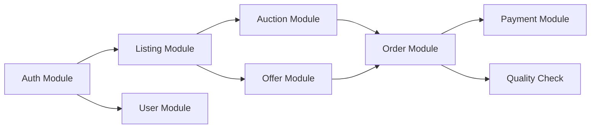

# /f5-planning - Project Planning & WBS Command

Generate Work Breakdown Structure (WBS), estimates, and sprint planning.

## ARGUMENTS
The user's request is: $ARGUMENTS

## ⚠️ CRITICAL OUTPUT RULES

**Output files MUST be in `.f5/planning/`**

| Document Type | Output Path |
|--------------|-------------|
| WBS | `.f5/planning/wbs.md` |
| Estimates | `.f5/planning/estimates.md` |
| Sprint Plan | `.f5/planning/sprints/sprint-{N}.md` |
| Roadmap | `.f5/planning/roadmap.md` |
| Resource Plan | `.f5/planning/resources.md` |

**❌ WRONG paths:**
```
docs/wbs.md ❌
planning.md ❌
wbs.md ❌
```

## STEP 1: PARSE ACTION

| Action | Description |
|--------|-------------|
| `wbs` | Generate Work Breakdown Structure |
| `estimate` | Estimate effort for tasks |
| `sprint` | Create sprint plan |
| `roadmap` | Generate project roadmap |
| `resource` | Resource allocation plan |
| `status` | Show planning status |

## ACTION: WBS

```
/f5-planning wbs [--from <source>]
```

### Sources
- `srs` - Generate from SRS requirements (default)
- `design` - Generate from design documents
- `screens` - Generate from screen list

### Process
1. Read SRS from `.f5/specs/srs/v1.0.0/srs.md`
2. Read Screen List from `.f5/specs/basic-design/v1.0.0/screens/screen-list.md`
3. Read API Design from `.f5/specs/basic-design/v1.0.0/api/api-design.md`
4. Generate hierarchical WBS
5. Output to `.f5/planning/wbs.md`

### Output Template

```markdown
# Work Breakdown Structure (WBS)

**Project:** {{PROJECT_NAME}}
**Generated:** {{TIMESTAMP}}
**Source:** {{SOURCE}}

## Summary

| Category | Items | Estimated Days |
|----------|-------|----------------|
| Backend | {{COUNT}} | {{DAYS}} |
| Frontend | {{COUNT}} | {{DAYS}} |
| Mobile | {{COUNT}} | {{DAYS}} |
| DevOps | {{COUNT}} | {{DAYS}} |
| **Total** | {{TOTAL}} | {{TOTAL_DAYS}} |

---

## 1. Backend Development

### 1.1 Authentication Module
| ID | Task | Priority | Est. Days | Dependencies |
|----|------|----------|-----------|--------------|
| BE-AUTH-001 | User Registration API | P0 | 1 | - |
| BE-AUTH-002 | OTP Verification | P0 | 0.5 | BE-AUTH-001 |
| BE-AUTH-003 | Login API | P0 | 0.5 | BE-AUTH-001 |
| BE-AUTH-004 | JWT Token Management | P0 | 1 | BE-AUTH-003 |
| BE-AUTH-005 | Password Reset | P1 | 0.5 | BE-AUTH-001 |

### 1.2 Listing Module
| ID | Task | Priority | Est. Days | Dependencies |
|----|------|----------|-----------|--------------|
| BE-LIST-001 | Create Listing API | P0 | 1.5 | BE-AUTH |
| BE-LIST-002 | Search & Filter API | P0 | 2 | BE-LIST-001 |
| BE-LIST-003 | Listing Detail API | P0 | 0.5 | BE-LIST-001 |

### 1.3 Auction Module
...

### 1.4 Order Module
...

### 1.5 Payment Module
...

---

## 2. Frontend Development (Web)

### 2.1 Authentication Screens
| ID | Task | Priority | Est. Days | Dependencies |
|----|------|----------|-----------|--------------|
| FE-AUTH-001 | Login Screen | P0 | 1 | BE-AUTH-003 |
| FE-AUTH-002 | Register Screen | P0 | 1 | BE-AUTH-001 |
| FE-AUTH-003 | OTP Screen | P0 | 0.5 | BE-AUTH-002 |

### 2.2 Listing Screens
...

---

## 3. Mobile Development (Flutter)

### 3.1 Authentication Screens
...

### 3.2 Farmer Screens
...

### 3.3 Buyer Screens
...

---

## 4. DevOps & Infrastructure

### 4.1 Initial Setup
| ID | Task | Priority | Est. Days | Dependencies |
|----|------|----------|-----------|--------------|
| DO-001 | Docker setup | P0 | 0.5 | - |
| DO-002 | CI/CD Pipeline | P0 | 1 | DO-001 |
| DO-003 | Database setup | P0 | 0.5 | DO-001 |

---

## 5. Testing

### 5.1 Unit Tests
...

### 5.2 Integration Tests
...

### 5.3 E2E Tests
...

---

## Dependencies Graph



---

## Priority Summary

| Priority | Tasks | Days | % of Total |
|----------|-------|------|------------|
| P0 (MVP) | {{P0_COUNT}} | {{P0_DAYS}} | {{P0_PERCENT}}% |
| P1 (Phase 2) | {{P1_COUNT}} | {{P1_DAYS}} | {{P1_PERCENT}}% |
| P2 (Future) | {{P2_COUNT}} | {{P2_DAYS}} | {{P2_PERCENT}}% |
```

## ACTION: ESTIMATE

```
/f5-planning estimate [--module <module>] [--team-size <n>]
```

### Estimation Factors

| Factor | Multiplier |
|--------|------------|
| Junior dev | 1.5x |
| Mid dev | 1.0x |
| Senior dev | 0.8x |
| New technology | 1.3x |
| Complex business logic | 1.4x |
| Simple CRUD | 0.7x |

### Output

```markdown
# Effort Estimation

**Project:** {{PROJECT_NAME}}
**Team Size:** {{TEAM_SIZE}}
**Generated:** {{TIMESTAMP}}

## Estimation Summary

| Module | Ideal Days | Adjusted Days | Team Days |
|--------|------------|---------------|-----------|
| Auth | 5 | 6.5 | 2 |
| Listing | 12 | 15.6 | 5 |
| Auction | 10 | 14 | 5 |
| Order | 15 | 19.5 | 7 |
| Payment | 8 | 10.4 | 4 |
| **Total** | 50 | 66 | 23 |

## Timeline

With {{TEAM_SIZE}} developers:
- **Optimistic:** {{OPT_WEEKS}} weeks
- **Realistic:** {{REAL_WEEKS}} weeks  
- **Pessimistic:** {{PESS_WEEKS}} weeks

## Risk Factors
- Payment integration complexity: +20%
- Third-party API dependencies: +15%
- New team members ramp-up: +10%
```

## ACTION: SPRINT

```
/f5-planning sprint [--number <n>] [--duration <days>]
```

### Default Sprint Duration
- 2 weeks (10 working days)

### Output

```markdown
# Sprint {{N}} Plan

**Duration:** {{START_DATE}} - {{END_DATE}}
**Team:** {{TEAM_MEMBERS}}
**Capacity:** {{CAPACITY}} story points

## Sprint Goals
1. {{GOAL_1}}
2. {{GOAL_2}}

## Sprint Backlog

| ID | Task | Assignee | Points | Status |
|----|------|----------|--------|--------|
| BE-AUTH-001 | User Registration | Dev A | 3 | To Do |
| BE-AUTH-002 | OTP Verification | Dev A | 2 | To Do |
| FE-AUTH-001 | Login Screen | Dev B | 3 | To Do |

## Definition of Done
- [ ] Code reviewed
- [ ] Unit tests written (≥80% coverage)
- [ ] Integration tests passing
- [ ] Documentation updated
- [ ] Deployed to staging

## Risks & Blockers
- {{RISK_1}}

## Dependencies
- {{DEP_1}}
```

## ACTION: ROADMAP

```
/f5-planning roadmap [--quarters <n>]
```

### Output

```markdown
# Project Roadmap

**Project:** {{PROJECT_NAME}}
**Generated:** {{TIMESTAMP}}

## Timeline Overview

```
Q1 2025          Q2 2025          Q3 2025          Q4 2025
├─────────────────┼─────────────────┼─────────────────┤
│   MVP           │   Phase 2       │   Scale         │
│   - Auth        │   - Analytics   │   - Multi-region│
│   - Listing     │   - Reports     │   - Performance │
│   - Auction     │   - Mobile v2   │   - Enterprise  │
│   - Order       │                 │                 │
└─────────────────┴─────────────────┴─────────────────┘
```

## Phase 1: MVP (Q1 2025)

### Month 1: Foundation
- Week 1-2: Auth + User module
- Week 3-4: Listing + Search

### Month 2: Core Features
- Week 5-6: Auction system
- Week 7-8: Order + Payment

### Month 3: Polish & Launch
- Week 9-10: QC + Notifications
- Week 11-12: Testing + Bug fixes

## Phase 2: Enhancement (Q2 2025)
...

## Milestones

| Milestone | Target Date | Status |
|-----------|-------------|--------|
| MVP Alpha | {{DATE}} | 🔄 |
| MVP Beta | {{DATE}} | ⏳ |
| Production Launch | {{DATE}} | ⏳ |
```

## ACTION: STATUS

```
/f5-planning status
```

### Output

```markdown
## 📊 Planning Status

**Project:** {{PROJECT_NAME}}

### Documents
| Document | Status | Last Updated |
|----------|--------|--------------|
| WBS | ✅ Generated | {{DATE}} |
| Estimates | ✅ Generated | {{DATE}} |
| Sprint 1 | ✅ Planned | {{DATE}} |
| Roadmap | ⏳ Pending | - |

### Current Sprint
- Sprint: {{CURRENT_SPRINT}}
- Progress: {{PERCENT}}%
- Days Remaining: {{DAYS}}

### Overall Progress
- Tasks Completed: {{DONE}}/{{TOTAL}}
- Story Points: {{SP_DONE}}/{{SP_TOTAL}}
```

## FLAGS

| Flag | Description |
|------|-------------|
| `--from <source>` | Source for WBS (srs, design, screens) |
| `--module <module>` | Specific module to estimate |
| `--team-size <n>` | Team size for calculation |
| `--number <n>` | Sprint number |
| `--duration <days>` | Sprint duration |
| `--quarters <n>` | Roadmap quarters |

## EXAMPLES

```bash
# Generate WBS from SRS
/f5-planning wbs

# Generate WBS from screens
/f5-planning wbs --from screens

# Estimate for specific module
/f5-planning estimate --module auth

# Estimate with team size
/f5-planning estimate --team-size 4

# Create Sprint 1 plan
/f5-planning sprint --number 1

# Create 2-week sprint
/f5-planning sprint --number 1 --duration 10

# Generate quarterly roadmap
/f5-planning roadmap --quarters 4

# Check planning status
/f5-planning status
```

## INTEGRATION WITH OTHER COMMANDS

```
/f5-spec generate srs          → Requirements
        ↓
/f5-design generate screen-list → Screens
        ↓
/f5-planning wbs               → WBS from screens/requirements
        ↓
/f5-planning estimate          → Effort estimation
        ↓
/f5-planning sprint            → Sprint planning
        ↓
/f5-implement init             → Start implementation
```

---
**Remember:** Good planning = Successful project!
