```mermaid
flowchart TD
    1f85ebea_8d8b_44b0_b17f_e2d67b6b4bf0([Start])
    614d08b8_0984_4028_8430_3477a1dc43a9[## Analyze]
    eade61ce_91c8_4d28_82b3_8ec561ff7963[## Design]
    f91fdfa2_d6dc_4a97_927d_230f5da719b9{{○ D3}}
    7fc4e1e1_a0a8_4a02_9208_267ddcfa1e6b[## Develop]
    5b4d111c_30c6_43ed_91e6_577bca410b29{{○ G2→G2.5→G3}}
    eb999073_6b7e_4f9b_a2b1_790c0b2038aa[## Release]
    ee636f53_6c97_418a_bb1e_9f54de733dc7[## Analyze]
    fc44e824_e6c8_48ce_81ec_917b33892baf[## Design]
    d2ff2daa_e1b8_4836_b3f0_7c21e6c0fa16{{○ D3}}
    4dcb29a2_a112_4957_bf8e_dcf36daa2991[## Develop]
    5bcd947a_37f6_4819_ad1f_ae3a1332830e{{○ G2→G2.5→G3}}
    96b2faae_e654_4193_aa72_f738bc267f79[## Release]
    8616a9d6_4fd6_4b70_9fa7_65b0e4bfe184([End])

    1f85ebea_8d8b_44b0_b17f_e2d67b6b4bf0 --> 614d08b8_0984_4028_8430_3477a1dc43a9
    614d08b8_0984_4028_8430_3477a1dc43a9 --> eade61ce_91c8_4d28_82b3_8ec561ff7963
    eade61ce_91c8_4d28_82b3_8ec561ff7963 --> f91fdfa2_d6dc_4a97_927d_230f5da719b9
    f91fdfa2_d6dc_4a97_927d_230f5da719b9 --> 7fc4e1e1_a0a8_4a02_9208_267ddcfa1e6b
    7fc4e1e1_a0a8_4a02_9208_267ddcfa1e6b --> 5b4d111c_30c6_43ed_91e6_577bca410b29
    5b4d111c_30c6_43ed_91e6_577bca410b29 --> eb999073_6b7e_4f9b_a2b1_790c0b2038aa
    eb999073_6b7e_4f9b_a2b1_790c0b2038aa --> ee636f53_6c97_418a_bb1e_9f54de733dc7
    ee636f53_6c97_418a_bb1e_9f54de733dc7 --> fc44e824_e6c8_48ce_81ec_917b33892baf
    fc44e824_e6c8_48ce_81ec_917b33892baf --> d2ff2daa_e1b8_4836_b3f0_7c21e6c0fa16
    d2ff2daa_e1b8_4836_b3f0_7c21e6c0fa16 --> 4dcb29a2_a112_4957_bf8e_dcf36daa2991
    4dcb29a2_a112_4957_bf8e_dcf36daa2991 --> 5bcd947a_37f6_4819_ad1f_ae3a1332830e
    5bcd947a_37f6_4819_ad1f_ae3a1332830e --> 96b2faae_e654_4193_aa72_f738bc267f79
    96b2faae_e654_4193_aa72_f738bc267f79 --> 8616a9d6_4fd6_4b70_9fa7_65b0e4bfe184
```

## Workflow Execution Guide

Follow the Mermaid flowchart above to execute the workflow. Each node type has specific execution methods as described below.

### Execution Methods by Node Type

- **Rectangle nodes**: Execute Sub-Agents using the Task tool
- **Diamond nodes (AskUserQuestion:...)**: Use the AskUserQuestion tool to prompt the user and branch based on their response
- **Diamond nodes (Branch/Switch:...)**: Automatically branch based on the results of previous processing (see details section)
- **Rectangle nodes (Prompt nodes)**: Execute the prompts described in the details section below

## Quality Gate Nodes

Quality Gates are F5 Framework checkpoints that ensure quality standards are met before proceeding.

#### f91fdfa2_d6dc_4a97_927d_230f5da719b9(D3)

**Gate**: D3

**Phase**: undefined

**Status**: ○ Pending

Use `/f5-gate check D3` to verify this gate or `/f5-gate pass D3` to mark it as passed.

#### 5b4d111c_30c6_43ed_91e6_577bca410b29(G2→G2.5→G3)

**Gate**: G2→G2.5→G3

**Phase**: undefined

**Status**: ○ Pending

Use `/f5-gate check G2→G2.5→G3` to verify this gate or `/f5-gate pass G2→G2.5→G3` to mark it as passed.

#### d2ff2daa_e1b8_4836_b3f0_7c21e6c0fa16(D3)

**Gate**: D3

**Phase**: undefined

**Status**: ○ Pending

Use `/f5-gate check D3` to verify this gate or `/f5-gate pass D3` to mark it as passed.

#### 5bcd947a_37f6_4819_ad1f_ae3a1332830e(G2→G2.5→G3)

**Gate**: G2→G2.5→G3

**Phase**: undefined

**Status**: ○ Pending

Use `/f5-gate check G2→G2.5→G3` to verify this gate or `/f5-gate pass G2→G2.5→G3` to mark it as passed.

### Prompt Node Details

#### 614d08b8_0984_4028_8430_3477a1dc43a9(## Analyze)

```
## Analyze

**Duration**: 2-3 days

**Duration**: 2-3 days

### Tasks
1. Load project context
   Command: `/f5:load`
2. Analyze feature request
   Command: `/f5:ba analyze-feature "Add user notifications"`
3. Impact analysis
   Command: `/f5:analyze impact --scope module`
4. Estimate effort
   Command: `/f5:estimate feature`


```

#### eade61ce_91c8_4d28_82b3_8ec561ff7963(## Design)

```
## Design

**Duration**: 2-5 days

**Duration**: 2-5 days

### Tasks
1. Design feature architecture
   Command: `/f5:design generate feature-architecture`
2. API design
   Command: `/f5:design generate api --feature notifications`
3. Database changes
   Command: `/f5:design generate migration`
4. Complete D3
   Command: `/f5:gate complete D3`


```

#### 7fc4e1e1_a0a8_4a02_9208_267ddcfa1e6b(## Develop)

```
## Develop

**Duration**: 1-3 weeks

**Duration**: 1-3 weeks

### Tasks
1. Create feature branch
2. Implement with traceability
   Command: `/f5-implement start FR-001`
3. Code review
   Command: `/f5-review code`
4. Complete G2
   Command: `/f5-gate complete G2`


```

#### eb999073_6b7e_4f9b_a2b1_790c0b2038aa(## Release)

```
## Release

**Duration**: 1-2 days

**Duration**: 1-2 days

### Tasks
1. Deploy to staging
   Command: `/f5:deploy staging`
2. UAT
   Command: `/f5:test uat`
3. Deploy to production
   Command: `/f5:deploy production`
4. Monitor
   Command: `/f5:monitor feature notifications`


```

#### ee636f53_6c97_418a_bb1e_9f54de733dc7(## Analyze)

```
## Analyze

**Essential:**


```

#### fc44e824_e6c8_48ce_81ec_917b33892baf(## Design)

```
## Design

**Essential:**


```

#### 4dcb29a2_a112_4957_bf8e_dcf36daa2991(## Develop)

```
## Develop

**Step 3.1 - Implementation (G2):**


```

#### 96b2faae_e654_4193_aa72_f738bc267f79(## Release)

```
## Release

**Essential:**


```
