```mermaid
flowchart TD
    c530ce81_275f_49dd_9716_96b1e8fcb327([Start])
    ad6db60b_2878_4153_ae4e_57ea17ab4f6f[## Analyze]
    22ee0645_1abc_45e3_8e7f_123829e02dfb[## Design]
    c37fe3de_7671_488a_8e2c_1e3f8d31d11d{{○ D3}}
    ed27bd4d_69f0_4e4b_86c4_a34f892ba9ca[## Develop]
    21746485_061e_4a2f_b66b_c0d1c713959c{{○ G2→G2.5→G3}}
    58b9e040_380f_4ea3_a0d6_27b2718511c3[## Release]
    064ded94_bf8e_49a5_aaa3_19d6939aad48[## Analyze]
    e1c50176_af4c_45db_869e_ffa63b464a1f[## Design]
    19dda829_36b2_487b_9b1e_44af6d425712{{○ D3}}
    0f9d58f5_e050_4e58_9adc_24cee899ad3c[## Develop]
    7e156aef_7648_47da_b51b_7c94c58f890b{{○ G2→G2.5→G3}}
    4467f297_af9f_42d8_84d9_2974cdad0928[## Release]
    cccb89cc_e34d_474c_a82b_cf70d7e8376e([End])

    c530ce81_275f_49dd_9716_96b1e8fcb327 --> ad6db60b_2878_4153_ae4e_57ea17ab4f6f
    ad6db60b_2878_4153_ae4e_57ea17ab4f6f --> 22ee0645_1abc_45e3_8e7f_123829e02dfb
    22ee0645_1abc_45e3_8e7f_123829e02dfb --> c37fe3de_7671_488a_8e2c_1e3f8d31d11d
    c37fe3de_7671_488a_8e2c_1e3f8d31d11d --> ed27bd4d_69f0_4e4b_86c4_a34f892ba9ca
    ed27bd4d_69f0_4e4b_86c4_a34f892ba9ca --> 21746485_061e_4a2f_b66b_c0d1c713959c
    21746485_061e_4a2f_b66b_c0d1c713959c --> 58b9e040_380f_4ea3_a0d6_27b2718511c3
    58b9e040_380f_4ea3_a0d6_27b2718511c3 --> 064ded94_bf8e_49a5_aaa3_19d6939aad48
    064ded94_bf8e_49a5_aaa3_19d6939aad48 --> e1c50176_af4c_45db_869e_ffa63b464a1f
    e1c50176_af4c_45db_869e_ffa63b464a1f --> 19dda829_36b2_487b_9b1e_44af6d425712
    19dda829_36b2_487b_9b1e_44af6d425712 --> 0f9d58f5_e050_4e58_9adc_24cee899ad3c
    0f9d58f5_e050_4e58_9adc_24cee899ad3c --> 7e156aef_7648_47da_b51b_7c94c58f890b
    7e156aef_7648_47da_b51b_7c94c58f890b --> 4467f297_af9f_42d8_84d9_2974cdad0928
    4467f297_af9f_42d8_84d9_2974cdad0928 --> cccb89cc_e34d_474c_a82b_cf70d7e8376e
```

## Workflow Execution Guide

Follow the Mermaid flowchart above to execute the workflow. Each node type has specific execution methods as described below.

### Execution Methods by Node Type

- **Rectangle nodes**: Execute Sub-Agents using the Task tool
- **Diamond nodes (AskUserQuestion:...)**: Use the AskUserQuestion tool to prompt the user and branch based on their response
- **Diamond nodes (Branch/Switch:...)**: Automatically branch based on the results of previous processing (see details section)
- **Rectangle nodes (Prompt nodes)**: Execute the prompts described in the details section below

## Quality Gate Nodes

Quality Gates are F5 Framework checkpoints that ensure quality standards are met before proceeding.

#### c37fe3de_7671_488a_8e2c_1e3f8d31d11d(D3)

**Gate**: D3

**Phase**: undefined

**Status**: ○ Pending

Use `/f5-gate check D3` to verify this gate or `/f5-gate pass D3` to mark it as passed.

#### 21746485_061e_4a2f_b66b_c0d1c713959c(G2→G2.5→G3)

**Gate**: G2→G2.5→G3

**Phase**: undefined

**Status**: ○ Pending

Use `/f5-gate check G2→G2.5→G3` to verify this gate or `/f5-gate pass G2→G2.5→G3` to mark it as passed.

#### 19dda829_36b2_487b_9b1e_44af6d425712(D3)

**Gate**: D3

**Phase**: undefined

**Status**: ○ Pending

Use `/f5-gate check D3` to verify this gate or `/f5-gate pass D3` to mark it as passed.

#### 7e156aef_7648_47da_b51b_7c94c58f890b(G2→G2.5→G3)

**Gate**: G2→G2.5→G3

**Phase**: undefined

**Status**: ○ Pending

Use `/f5-gate check G2→G2.5→G3` to verify this gate or `/f5-gate pass G2→G2.5→G3` to mark it as passed.

### Prompt Node Details

#### ad6db60b_2878_4153_ae4e_57ea17ab4f6f(## Analyze)

```
## Analyze

**Duration**: 2-3 days

**Duration**: 2-3 days

### Tasks
1. Load project context
   Command: `/f5:load`
2. Analyze feature request
   Command: `/f5:ba analyze-feature "Add user notifications"`
3. Impact analysis
   Command: `/f5:analyze impact --scope module`
4. Estimate effort
   Command: `/f5:estimate feature`


```

#### 22ee0645_1abc_45e3_8e7f_123829e02dfb(## Design)

```
## Design

**Duration**: 2-5 days

**Duration**: 2-5 days

### Tasks
1. Design feature architecture
   Command: `/f5:design generate feature-architecture`
2. API design
   Command: `/f5:design generate api --feature notifications`
3. Database changes
   Command: `/f5:design generate migration`
4. Complete D3
   Command: `/f5:gate complete D3`


```

#### ed27bd4d_69f0_4e4b_86c4_a34f892ba9ca(## Develop)

```
## Develop

**Duration**: 1-3 weeks

**Duration**: 1-3 weeks

### Tasks
1. Create feature branch
2. Implement with traceability
   Command: `/f5-implement start FR-001`
3. Code review
   Command: `/f5-review code`
4. Complete G2
   Command: `/f5-gate complete G2`


```

#### 58b9e040_380f_4ea3_a0d6_27b2718511c3(## Release)

```
## Release

**Duration**: 1-2 days

**Duration**: 1-2 days

### Tasks
1. Deploy to staging
   Command: `/f5:deploy staging`
2. UAT
   Command: `/f5:test uat`
3. Deploy to production
   Command: `/f5:deploy production`
4. Monitor
   Command: `/f5:monitor feature notifications`


```

#### 064ded94_bf8e_49a5_aaa3_19d6939aad48(## Analyze)

```
## Analyze

**Essential:**


```

#### e1c50176_af4c_45db_869e_ffa63b464a1f(## Design)

```
## Design

**Essential:**


```

#### 0f9d58f5_e050_4e58_9adc_24cee899ad3c(## Develop)

```
## Develop

**Step 3.1 - Implementation (G2):**


```

#### 4467f297_af9f_42d8_84d9_2974cdad0928(## Release)

```
## Release

**Essential:**


```
