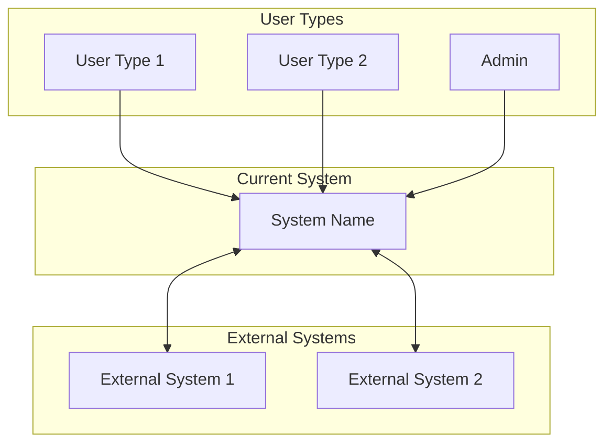
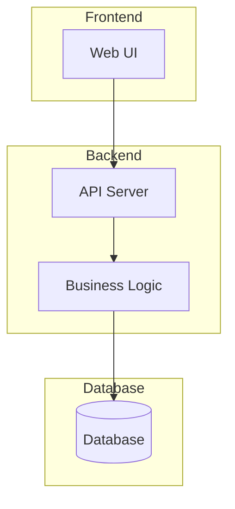
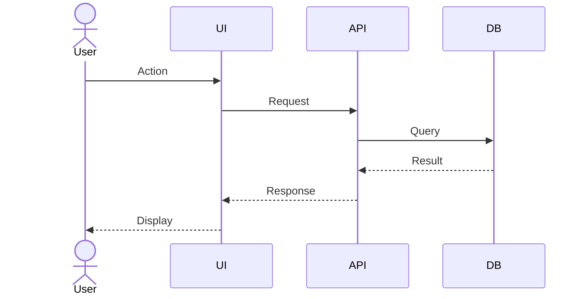
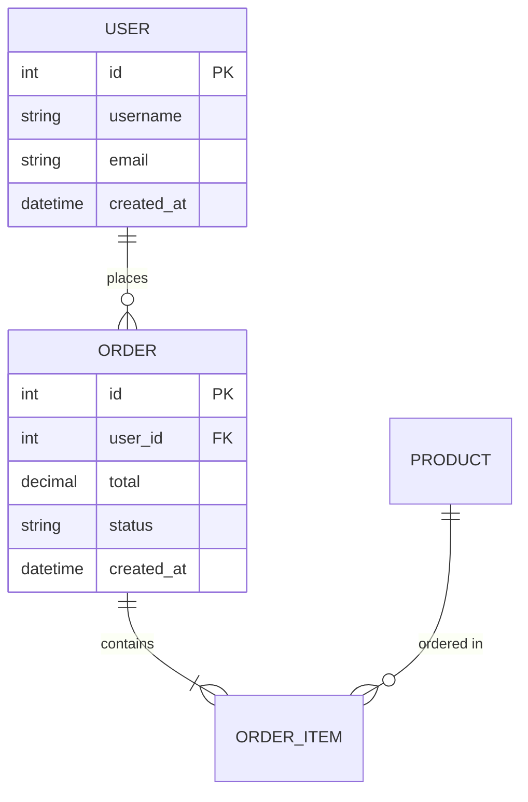

# AS-IS Software Requirements Specification
## [System Name] - Current System Documentation

---

## Document Control

| Field | Value |
|-------|-------|
| Document ID | AS-IS-SRS-[PROJECT]-001 |
| Version | 1.0 |
| Created | [DATE] |
| Last Updated | [DATE] |
| Status | Draft / Review / Approved |
| Author | [NAME] |
| Approved By | [NAME] |

---

## 1. Introduction

### 1.1 Purpose
Tài liệu này mô tả hệ thống [SYSTEM NAME] hiện tại đang vận hành.
Mục đích là capture toàn bộ chức năng, business rules, và technical details
để làm baseline cho việc migrate sang hệ thống mới.

### 1.2 Scope
- **Included**: [List modules/features được document]
- **Excluded**: [List modules/features không trong scope]

### 1.3 Discovery Sources
| Source Type | Description | Access |
|-------------|-------------|--------|
| Running System | Production environment | [URL] |
| Database | [Type] database | [Connection info] |
| Source Code | [Repository] | [URL] |
| Stakeholder Interviews | [List of people] | [Dates] |
| Existing Documents | [List if any] | [Location] |

---

## 2. System Overview

### 2.1 System Context
[Mô tả hệ thống trong bối cảnh business - hệ thống này làm gì, ai dùng]



### 2.2 User Roles
| Role | Description | Permissions |
|------|-------------|-------------|
| [Role 1] | [Description] | [What they can do] |
| [Role 2] | [Description] | [What they can do] |

### 2.3 System Architecture (Current)


---

## 3. Functional Requirements (AS-IS)

### 3.1 Module: [Module Name 1]

#### 3.1.1 Feature: [Feature Name]
| Field | Value |
|-------|-------|
| ID | AS-FR-001 |
| Name | [Feature Name] |
| Description | [What it does currently] |
| Discovered From | [DB/Code/Interview/Observation] |
| Status | Active / Deprecated / Partially Working |

**Current Behavior:**
[Mô tả chi tiết cách feature hoạt động hiện tại]

**User Flow:**


**Business Rules (Extracted):**
| Rule ID | Rule Description | Source |
|---------|------------------|--------|
| BR-001 | [Rule description] | [Code/Interview] |
| BR-002 | [Rule description] | [Code/Interview] |

**Data Involved:**
| Entity | Fields Used | Operations |
|--------|-------------|------------|
| [Entity 1] | [field1, field2] | CRUD |

**Known Issues:**
- [Issue 1 - discovered during analysis]
- [Issue 2]

---

### 3.2 Module: [Module Name 2]
[Repeat structure for each module]

---

## 4. Data Model (AS-IS)

### 4.1 Entity Relationship Diagram


### 4.2 Data Dictionary

#### Table: [table_name]
| Column | Type | Nullable | Default | Description |
|--------|------|----------|---------|-------------|
| id | INT | NO | AUTO_INCREMENT | Primary key |
| [column] | [type] | [YES/NO] | [default] | [description] |

**Indexes:**
| Index Name | Columns | Type |
|------------|---------|------|
| PRIMARY | id | PRIMARY |
| [idx_name] | [columns] | [UNIQUE/INDEX] |

**Foreign Keys:**
| FK Name | Column | References |
|---------|--------|------------|
| [fk_name] | [column] | [table.column] |

---

## 5. API Inventory (AS-IS)

### 5.1 API Overview
| Base URL | Authentication | Format |
|----------|---------------|--------|
| [URL] | [Type] | JSON |

### 5.2 Endpoints

#### [Module Name]

| Method | Endpoint | Description | Auth |
|--------|----------|-------------|------|
| GET | /api/[resource] | List resources | [Role] |
| POST | /api/[resource] | Create resource | [Role] |
| GET | /api/[resource]/:id | Get single | [Role] |
| PUT | /api/[resource]/:id | Update | [Role] |
| DELETE | /api/[resource]/:id | Delete | [Role] |

**Endpoint Detail: GET /api/[resource]**

Request:
```json
{
  "query_params": {
    "page": "number",
    "limit": "number",
    "filter": "string"
  }
}
```

Response:
```json
{
  "data": [],
  "pagination": {
    "total": 100,
    "page": 1,
    "limit": 10
  }
}
```

---

## 6. Business Rules (AS-IS)

### 6.1 Validation Rules
| Rule ID | Entity | Field | Rule | Source |
|---------|--------|-------|------|--------|
| VR-001 | User | email | Must be unique | Code |
| VR-002 | Order | total | Must be > 0 | Code |

### 6.2 Calculation Rules
| Rule ID | Description | Formula | Source |
|---------|-------------|---------|--------|
| CR-001 | Order total | SUM(items.price * items.qty) | Code |
| CR-002 | Tax calculation | total * tax_rate | Interview |

### 6.3 Workflow Rules
| Rule ID | Trigger | Condition | Action | Source |
|---------|---------|-----------|--------|--------|
| WR-001 | Order created | total > 1000 | Require approval | Interview |

---

## 7. Integration Points (AS-IS)

### 7.1 External System Integrations
| System | Type | Protocol | Purpose |
|--------|------|----------|---------|
| [System 1] | [Inbound/Outbound] | [REST/SOAP/File] | [Purpose] |

### 7.2 Integration Details

#### Integration: [System Name]
| Field | Value |
|-------|-------|
| Direction | Inbound / Outbound / Bidirectional |
| Protocol | REST API / SOAP / File Transfer / Message Queue |
| Authentication | API Key / OAuth / Certificate |
| Frequency | Real-time / Batch (schedule) |

**Data Exchanged:**
| Data | Direction | Format | Volume |
|------|-----------|--------|--------|
| [Data type] | IN/OUT | JSON/XML/CSV | [est. records/day] |

---

## 8. Non-Functional Characteristics (AS-IS)

### 8.1 Performance (Observed)
| Metric | Current Value | Measurement Method |
|--------|---------------|-------------------|
| Page Load Time | [X] seconds | Browser DevTools |
| API Response Time | [X] ms average | Logs/Monitoring |
| Concurrent Users | [X] estimated | Interview |

### 8.2 Security (Current)
| Aspect | Current Implementation |
|--------|----------------------|
| Authentication | [Method] |
| Authorization | [Method] |
| Data Encryption | [Yes/No - details] |
| Audit Logging | [Yes/No - details] |

### 8.3 Known Technical Debt
| ID | Description | Impact | Priority |
|----|-------------|--------|----------|
| TD-001 | [Description] | [Impact] | High/Medium/Low |

---

## 9. User Interface Inventory (AS-IS)

### 9.1 Screen List
| Screen ID | Name | URL/Route | User Roles | Screenshot |
|-----------|------|-----------|------------|------------|
| SCR-001 | [Name] | /path | [Roles] | [Link] |

### 9.2 Screen Details

#### Screen: [Screen Name]
| Field | Value |
|-------|-------|
| ID | SCR-001 |
| Description | [What the screen does] |
| Access | [Who can access] |
| Screenshot |  |

**UI Elements:**
| Element | Type | Data Source | Actions |
|---------|------|-------------|---------|
| [Element 1] | Table/Form/Button | [Entity] | [Actions] |

**User Actions:**
| Action | Description | Result |
|--------|-------------|--------|
| [Action 1] | [What user does] | [What happens] |

---

## 10. Reports (AS-IS)

### 10.1 Report Inventory
| Report ID | Name | Type | Frequency | Users |
|-----------|------|------|-----------|-------|
| RPT-001 | [Name] | [Screen/Export] | [Daily/Weekly/Ad-hoc] | [Roles] |

### 10.2 Report Details

#### Report: [Report Name]
| Field | Value |
|-------|-------|
| ID | RPT-001 |
| Description | [What it shows] |
| Data Sources | [Tables/Views used] |
| Filters | [Available filters] |
| Export Formats | [PDF/Excel/CSV] |

---

## 11. Pain Points & Issues (Discovered)

### 11.1 User Pain Points
| ID | Description | Reported By | Frequency | Impact |
|----|-------------|-------------|-----------|--------|
| PP-001 | [Pain point description] | [Role/Name] | [Often/Sometimes] | [High/Med/Low] |

### 11.2 Technical Issues
| ID | Description | Root Cause | Workaround |
|----|-------------|------------|------------|
| TI-001 | [Issue description] | [Cause if known] | [Current workaround] |

### 11.3 Missing Features (Requested)
| ID | Description | Requested By | Priority |
|----|-------------|--------------|----------|
| MF-001 | [Feature description] | [Role/Name] | [High/Med/Low] |

---

## 12. Appendices

### Appendix A: Stakeholder Interview Notes
[Reference to interview-notes/ folder]

### Appendix B: Screenshots
[Reference to screenshots/ folder]

### Appendix C: Database Schema Export
[Reference to database-schema.md]

### Appendix D: API Documentation (Raw)
[Reference to api-inventory.md]

### Appendix E: Source Code Analysis
[Reference to code-structure.md and business-rules-from-code.md]

---

## Document History

| Version | Date | Author | Changes |
|---------|------|--------|---------|
| 1.0 | [DATE] | [NAME] | Initial document |

---

*Generated by F5 Framework - Legacy Migration Workflow*
