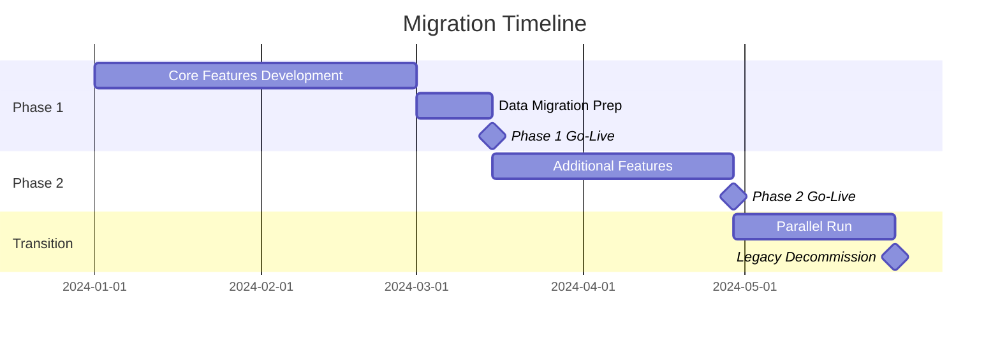
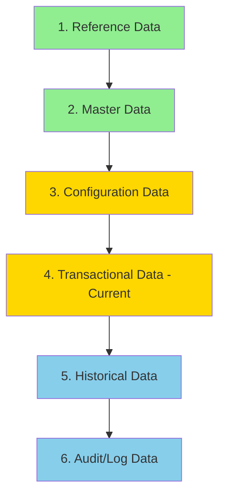
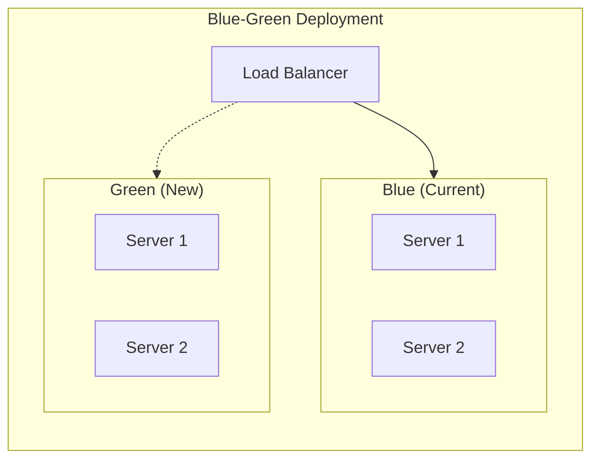

# Migration Plan
## [System Name] - Legacy to New System Migration

---

## Document Control

| Field | Value |
|-------|-------|
| Document ID | MIG-PLAN-[PROJECT]-001 |
| Version | 1.0 |
| Created | [DATE] |
| Last Updated | [DATE] |
| Status | Draft / Review / Approved |
| Author | [NAME] |
| Approved By | [NAME] |

### Reference Documents
| Document | Version |
|----------|---------|
| AS-IS SRS | [Version] |
| TO-BE SRS | [Version] |
| Gap Analysis | [Version] |

---

## 1. Executive Summary

### 1.1 Migration Overview
[Brief description of the migration project - what system is being migrated, why, and high-level approach]

### 1.2 Key Dates
| Milestone | Target Date | Status |
|-----------|-------------|--------|
| Migration Plan Approved | [DATE] | Pending |
| Development Start | [DATE] | Pending |
| Phase 1 Go-Live | [DATE] | Pending |
| Phase 2 Go-Live | [DATE] | Pending |
| Full Migration Complete | [DATE] | Pending |
| Legacy System Decommission | [DATE] | Pending |

### 1.3 Success Criteria
| Criteria | Target | Measurement |
|----------|--------|-------------|
| Data Migration Accuracy | 100% | Post-migration audit |
| System Availability | 99.9% | Monitoring |
| User Adoption | > 90% within 1 month | Usage analytics |
| Performance | Meet TO-BE NFRs | Load testing |
| Zero Data Loss | 0 records lost | Data reconciliation |

---

## 2. Migration Strategy

### 2.1 Overall Approach
[Choose and describe the migration approach]

**Selected Strategy:** [Big Bang / Phased / Parallel Run / Strangler Pattern]



### 2.2 Migration Phases

#### Phase 1: Foundation & Core Features
| Item | Description | Duration | Dependencies |
|------|-------------|----------|--------------|
| Infrastructure Setup | Cloud/Server setup | 2 weeks | Budget approval |
| Core Module A | [Description] | 4 weeks | Infrastructure |
| Core Module B | [Description] | 3 weeks | Module A |
| Data Migration (Core) | User, Core data | 1 week | All modules |
| UAT | User acceptance testing | 2 weeks | Data migration |
| Go-Live Phase 1 | Production deployment | 1 week | UAT approval |

#### Phase 2: Extended Features
| Item | Description | Duration | Dependencies |
|------|-------------|----------|--------------|
| Module C | [Description] | 3 weeks | Phase 1 |
| Module D | [Description] | 3 weeks | Phase 1 |
| Integration X | [Description] | 2 weeks | Module C |
| Data Migration (Extended) | Historical data | 1 week | All modules |
| UAT | User acceptance testing | 2 weeks | Data migration |
| Go-Live Phase 2 | Production deployment | 1 week | UAT approval |

#### Phase 3: Transition & Decommission
| Item | Description | Duration | Dependencies |
|------|-------------|----------|--------------|
| Parallel Run | Both systems active | 4 weeks | Phase 2 |
| User Training | Complete training | 2 weeks | Parallel run |
| Legacy Decommission | Shutdown old system | 2 weeks | Transition complete |
| Post-Migration Support | Hyper-care period | 4 weeks | Decommission |

---

## 3. Data Migration Plan

### 3.1 Data Migration Overview
| Source | Target | Volume | Method | Priority |
|--------|--------|--------|--------|----------|
| [Table 1] | [New Table 1] | [X] rows | ETL | P1 |
| [Table 2] | [New Table 2] | [X] rows | Direct Copy | P1 |
| [Table 3] | [New Table 3] | [X] rows | Transform | P2 |

### 3.2 Migration Sequence


### 3.3 Data Transformation Rules

#### Transformation: [Source Table] → [Target Table]
| Source Field | Target Field | Transformation | Notes |
|--------------|--------------|----------------|-------|
| id (INT) | id (UUID) | Generate UUID, create mapping | Keep mapping 6 months |
| status | status | Map: 'A'→'active', 'I'→'inactive' | |
| created_date | created_at | Convert to UTC timestamp | |
| - | updated_at | Set to migration timestamp | New field |

**Migration Script:**
```sql
-- Example transformation
INSERT INTO new_system.users (id, username, email, status, created_at, updated_at)
SELECT
    gen_random_uuid(),
    username,
    email,
    CASE status WHEN 'A' THEN 'active' WHEN 'I' THEN 'inactive' END,
    created_date AT TIME ZONE 'UTC',
    NOW()
FROM old_system.users;

-- Create mapping table
INSERT INTO migration_mapping (old_id, new_id, table_name)
SELECT old.id, new.id, 'users'
FROM old_system.users old
JOIN new_system.users new ON old.username = new.username;
```

### 3.4 Data Validation

#### Pre-Migration Validation
| Check | Query/Script | Expected Result |
|-------|--------------|-----------------|
| Record count | SELECT COUNT(*) FROM [table] | [X] records |
| Data integrity | [Validation query] | No errors |
| Foreign keys | [FK validation] | All valid |

#### Post-Migration Validation
| Check | Validation Method | Acceptance Criteria |
|-------|-------------------|---------------------|
| Record count match | Compare source/target counts | 100% match |
| Data accuracy | Sample audit (5%) | 99.99% accuracy |
| Referential integrity | FK constraint check | All valid |
| Business logic | Run validation queries | All pass |

### 3.5 Data Migration Rollback
| Scenario | Rollback Procedure | RTO |
|----------|-------------------|-----|
| Migration script failure | Restore from pre-migration backup | 2 hours |
| Data corruption detected | Re-run migration from checkpoint | 4 hours |
| Full rollback needed | Restore complete backup | 8 hours |

---

## 4. Application Migration Plan

### 4.1 Development Phases

#### Phase 1: Core Application
| Component | Description | Team | Duration | Status |
|-----------|-------------|------|----------|--------|
| Backend API | Core API endpoints | Backend Team | 4 weeks | Not Started |
| Database | Schema & migrations | DBA Team | 2 weeks | Not Started |
| Frontend | Core UI screens | Frontend Team | 4 weeks | Not Started |
| Authentication | OAuth 2.0 + MFA | Security Team | 2 weeks | Not Started |

#### Phase 2: Extended Features
| Component | Description | Team | Duration | Status |
|-----------|-------------|------|----------|--------|
| Reporting | New reports module | Backend Team | 2 weeks | Not Started |
| Integrations | External system APIs | Integration Team | 3 weeks | Not Started |
| Mobile | Mobile app | Mobile Team | 4 weeks | Not Started |

### 4.2 Environment Setup
| Environment | Purpose | Infrastructure | Status |
|-------------|---------|----------------|--------|
| Development | Developer work | [Specs] | Not Started |
| Testing/QA | QA testing | [Specs] | Not Started |
| Staging | Pre-production | [Specs] | Not Started |
| Production | Live system | [Specs] | Not Started |

### 4.3 Deployment Strategy
**Selected Strategy:** [Blue-Green / Canary / Rolling]



---

## 5. Integration Migration Plan

### 5.1 Integration Cutover Sequence
| Priority | Integration | Approach | Cutover Window |
|----------|-------------|----------|----------------|
| 1 | [Integration A] | Parallel then switch | 2 hours |
| 2 | [Integration B] | Direct cutover | 30 minutes |
| 3 | [Integration C] | New integration | N/A |

### 5.2 Integration Testing Plan
| Integration | Test Type | Test Cases | Sign-off |
|-------------|-----------|------------|----------|
| [Integration A] | End-to-end | [X] cases | [Owner] |
| [Integration B] | Regression | [X] cases | [Owner] |

### 5.3 External Party Coordination
| Party | Contact | Notification Date | Coordination Needed |
|-------|---------|-------------------|---------------------|
| [Vendor A] | [Contact] | [Date] | API endpoint change |
| [Partner B] | [Contact] | [Date] | Credential update |

---

## 6. Testing Plan

### 6.1 Test Phases
| Phase | Type | Duration | Entry Criteria | Exit Criteria |
|-------|------|----------|----------------|---------------|
| Unit Testing | Automated | Continuous | Code complete | 80% coverage |
| Integration Testing | Automated + Manual | 2 weeks | Unit tests pass | All integrations work |
| System Testing | Manual + Automated | 2 weeks | Integration complete | All features work |
| UAT | Manual | 2 weeks | System testing pass | User sign-off |
| Performance Testing | Automated | 1 week | UAT pass | Meet NFRs |
| Security Testing | Automated + Manual | 1 week | UAT pass | No critical issues |

### 6.2 UAT Plan
| Module | Test Scenarios | Users | Duration | Sign-off |
|--------|---------------|-------|----------|----------|
| [Module A] | [X] scenarios | [User group] | 3 days | [Owner] |
| [Module B] | [X] scenarios | [User group] | 3 days | [Owner] |

### 6.3 Performance Test Criteria
| Metric | Target | Test Approach |
|--------|--------|---------------|
| Response Time | < 200ms (95th percentile) | Load test |
| Throughput | 1000 requests/second | Stress test |
| Concurrent Users | 1000 users | Load test |
| Error Rate | < 0.1% | Soak test |

---

## 7. Cutover Plan

### 7.1 Cutover Timeline

```mermaid
gantt
    title Cutover Weekend Schedule
    dateFormat  HH:mm
    axisFormat %H:%M

    section Friday
    Freeze Changes       :f1, 18:00, 2h
    Full Backup         :f2, after f1, 3h

    section Saturday
    Data Migration      :s1, 00:00, 6h
    Validation          :s2, after s1, 4h
    Application Deploy  :s3, after s2, 2h
    Smoke Testing       :s4, after s3, 2h

    section Sunday
    Integration Testing :su1, 08:00, 4h
    UAT Verification    :su2, after su1, 4h
    Go/No-Go Decision   :milestone, m1, after su2, 0h
    Go-Live             :su3, after m1, 1h
```


### 7.2 Cutover Checklist

#### Pre-Cutover (T-7 days to T-1 day)
| # | Task | Owner | Status | Sign-off |
|---|------|-------|--------|----------|
| 1 | Final code freeze | Dev Lead | ☐ | |
| 2 | Backup verification | DBA | ☐ | |
| 3 | Runbook review | Ops | ☐ | |
| 4 | Communication sent to users | PM | ☐ | |
| 5 | Support team briefed | Support Lead | ☐ | |

#### Cutover Day
| # | Time | Task | Owner | Status | Rollback Point |
|---|------|------|-------|--------|----------------|
| 1 | 18:00 | Stop old system writes | DBA | ☐ | RP-1 |
| 2 | 18:30 | Final data backup | DBA | ☐ | |
| 3 | 19:00 | Start data migration | Migration Team | ☐ | RP-2 |
| 4 | 01:00 | Data validation | QA | ☐ | RP-3 |
| 5 | 02:00 | Deploy new application | DevOps | ☐ | RP-4 |
| 6 | 03:00 | Smoke testing | QA | ☐ | |
| 7 | 04:00 | Integration testing | QA | ☐ | |
| 8 | 06:00 | Go/No-Go decision | Steering | ☐ | |
| 9 | 07:00 | Enable user access | Ops | ☐ | |
| 10 | 08:00 | Monitor & support | All | ☐ | |

### 7.3 Go/No-Go Criteria

#### Go Criteria
| Criteria | Target | Actual | Status |
|----------|--------|--------|--------|
| Data migration complete | 100% | | ☐ |
| Data validation pass | > 99.9% | | ☐ |
| Core smoke tests pass | 100% | | ☐ |
| Critical integrations working | 100% | | ☐ |
| No P1 defects | 0 | | ☐ |
| Rollback tested | Yes | | ☐ |

#### No-Go Triggers
| Trigger | Action |
|---------|--------|
| Data migration < 99% | Investigate, fix, re-migrate |
| P1 defect found | Assess impact, fix or rollback |
| Integration failure | Activate contingency or rollback |
| > 2 hour delay | Reassess timeline |

---

## 8. Rollback Plan

### 8.1 Rollback Decision Matrix
| Scenario | Severity | Decision | Rollback Time |
|----------|----------|----------|---------------|
| Minor data issues | Low | Continue with fix | N/A |
| Single module failure | Medium | Partial rollback | 1 hour |
| Multiple critical failures | High | Full rollback | 4 hours |
| Data corruption | Critical | Immediate full rollback | 4 hours |

### 8.2 Rollback Procedures

#### Full Rollback Procedure
| Step | Action | Owner | Time |
|------|--------|-------|------|
| 1 | Announce rollback decision | Migration Lead | 5 min |
| 2 | Stop new system | DevOps | 10 min |
| 3 | Restore database from backup | DBA | 2 hours |
| 4 | Re-enable old system | Ops | 30 min |
| 5 | Validate old system | QA | 30 min |
| 6 | Update DNS/routing | DevOps | 10 min |
| 7 | Announce to users | PM | 5 min |

### 8.3 Rollback Communication Template
```
Subject: [URGENT] System Migration Rollback - [System Name]

The migration to the new [System Name] has been rolled back.

Status: Old system is now active
Reason: [Brief reason]
Impact: [What users need to know]
Next Steps: [What happens next]

Please use: [Old system URL]
Support: [Contact info]
```

---

## 9. Communication Plan

### 9.1 Stakeholder Communication Matrix
| Stakeholder | Communication | Frequency | Channel | Owner |
|-------------|---------------|-----------|---------|-------|
| Executive Sponsors | Status update | Weekly | Email/Meeting | PM |
| All Users | Migration notice | Key milestones | Email | PM |
| IT Support | Technical details | As needed | Slack/Meeting | Tech Lead |
| External Partners | API changes | 30 days before | Email | Integration Lead |

### 9.2 Communication Schedule
| Date | Audience | Message | Channel |
|------|----------|---------|---------|
| T-30 days | All users | Migration announcement | Email |
| T-14 days | All users | Preparation instructions | Email |
| T-7 days | All users | Final reminder | Email |
| T-1 day | All users | Downtime notification | Email + Banner |
| T-0 | All users | Go-live announcement | Email + Banner |
| T+1 day | All users | Success/feedback request | Email |

### 9.3 Communication Templates

#### Pre-Migration Announcement
```
Subject: Upcoming System Migration - [System Name]

Dear Users,

We are migrating to a new and improved [System Name] on [DATE].

What's New:
- [Key improvement 1]
- [Key improvement 2]

What You Need to Do:
1. [Action 1]
2. [Action 2]

Training Resources:
- [Link to training materials]

Questions? Contact [Support email]
```

---

## 10. Training Plan

### 10.1 Training Matrix
| Role | Training Type | Duration | Timing | Materials |
|------|---------------|----------|--------|-----------|
| End Users | Self-paced + Workshop | 2 hours | T-14 days | Videos, Guide |
| Power Users | Hands-on workshop | 4 hours | T-7 days | Workshop, Lab |
| Administrators | Technical training | 8 hours | T-7 days | Manual, Lab |
| Support Team | Deep-dive training | 16 hours | T-14 days | All materials |

### 10.2 Training Materials
| Material | Type | Status | Location |
|----------|------|--------|----------|
| User Guide | Document | Not Started | [Link] |
| Quick Reference | Document | Not Started | [Link] |
| Training Videos | Video | Not Started | [Link] |
| FAQ | Document | Not Started | [Link] |
| Admin Manual | Document | Not Started | [Link] |

### 10.3 Training Schedule
| Session | Date | Time | Attendees | Trainer |
|---------|------|------|-----------|---------|
| End User - Group 1 | [Date] | [Time] | [X] users | [Trainer] |
| End User - Group 2 | [Date] | [Time] | [X] users | [Trainer] |
| Power User | [Date] | [Time] | [X] users | [Trainer] |
| Administrator | [Date] | [Time] | [X] users | [Trainer] |

---

## 11. Support Plan

### 11.1 Hyper-Care Period
| Phase | Duration | Support Level | Team |
|-------|----------|---------------|------|
| Go-Live Week | 7 days | 24/7 on-site | Full team |
| Week 2-4 | 3 weeks | Extended hours (6am-10pm) | Core team |
| Month 2 | 4 weeks | Business hours + on-call | Normal + on-call |
| Steady State | Ongoing | Business hours | Normal support |

### 11.2 Support Contacts
| Role | Name | Phone | Email | Availability |
|------|------|-------|-------|--------------|
| Migration Lead | [Name] | [Phone] | [Email] | 24/7 during cutover |
| Technical Lead | [Name] | [Phone] | [Email] | 24/7 during cutover |
| DBA | [Name] | [Phone] | [Email] | On-call |
| Support Lead | [Name] | [Phone] | [Email] | Business hours |

### 11.3 Issue Escalation Matrix
| Severity | Response Time | Resolution Time | Escalation Path |
|----------|---------------|-----------------|-----------------|
| P1 - Critical | 15 minutes | 4 hours | Support → Tech Lead → Migration Lead → Sponsor |
| P2 - High | 1 hour | 8 hours | Support → Tech Lead |
| P3 - Medium | 4 hours | 24 hours | Support |
| P4 - Low | 1 business day | 5 business days | Support |

---

## 12. Risk Management

### 12.1 Risk Register
| ID | Risk | Probability | Impact | Score | Mitigation | Owner |
|----|------|-------------|--------|-------|------------|-------|
| R1 | Data migration failure | Medium | High | 6 | Multiple test runs, rollback plan | DBA |
| R2 | Integration issues | Medium | High | 6 | Early testing, partner coordination | Integration Lead |
| R3 | User resistance | Medium | Medium | 4 | Training, communication, champions | PM |
| R4 | Performance issues | Low | High | 3 | Load testing, capacity planning | Tech Lead |
| R5 | Timeline slippage | Medium | Medium | 4 | Buffer time, regular tracking | PM |

### 12.2 Contingency Plans
| Risk | Trigger | Contingency Action |
|------|---------|-------------------|
| Data migration failure | > 2 hours delay | Activate backup team, extend window |
| Integration issues | Critical integration fails | Enable manual workaround, rollback |
| Performance issues | Response > 500ms | Scale up resources, optimize queries |

---

## 13. Post-Migration Activities

### 13.1 Immediate Post-Migration (Week 1)
| Task | Owner | Timeline | Status |
|------|-------|----------|--------|
| Monitor system health | Ops | Continuous | ☐ |
| Address user issues | Support | As needed | ☐ |
| Performance monitoring | Tech Lead | Daily | ☐ |
| Daily status meetings | PM | Daily 9am | ☐ |
| Document lessons learned | PM | End of week | ☐ |

### 13.2 Short-Term (Month 1)
| Task | Owner | Timeline | Status |
|------|-------|----------|--------|
| User adoption tracking | PM | Weekly | ☐ |
| Performance optimization | Tech Lead | As needed | ☐ |
| Bug fixes | Dev Team | As needed | ☐ |
| Training reinforcement | Training | As needed | ☐ |

### 13.3 Legacy Decommission Checklist
| Task | Owner | Status | Date |
|------|-------|--------|------|
| All users migrated | PM | ☐ | |
| Data archived | DBA | ☐ | |
| Integrations disconnected | Integration Lead | ☐ | |
| Servers decommissioned | Ops | ☐ | |
| Documentation archived | PM | ☐ | |
| Licenses cancelled | Procurement | ☐ | |

---

## 14. Appendices

### Appendix A: Detailed Cutover Runbook
[Link to detailed step-by-step runbook]

### Appendix B: Data Migration Scripts
[Link to migration scripts repository]

### Appendix C: Rollback Scripts
[Link to rollback scripts]

### Appendix D: Contact List
[Complete contact list for migration team]

### Appendix E: Environment Details
[Infrastructure and configuration details]

---

## Document History

| Version | Date | Author | Changes |
|---------|------|--------|---------|
| 1.0 | [DATE] | [NAME] | Initial migration plan |

---

## Approval

| Role | Name | Signature | Date |
|------|------|-----------|------|
| Project Sponsor | [Name] | | |
| Technical Lead | [Name] | | |
| Business Owner | [Name] | | |
| QA Lead | [Name] | | |

---

*Generated by F5 Framework - Legacy Migration Workflow*
