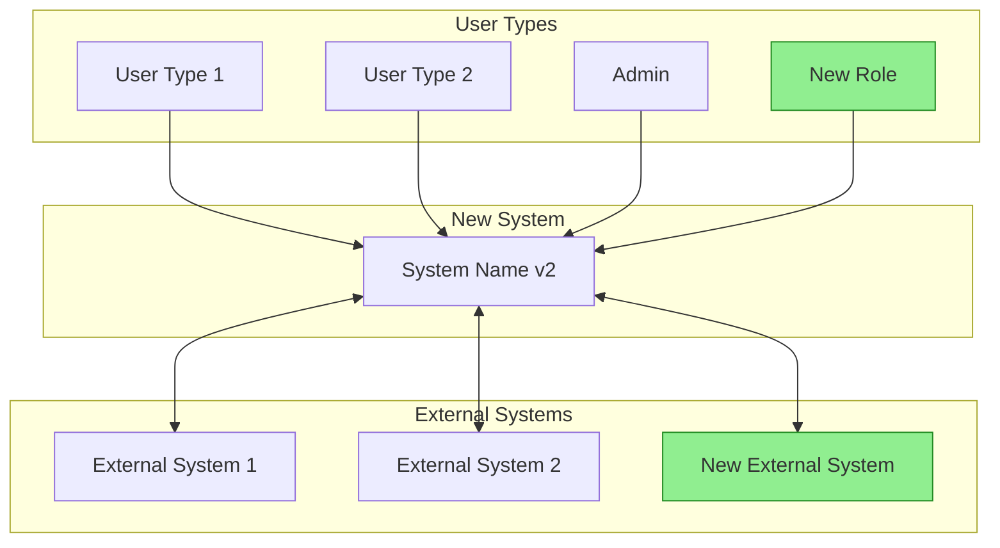
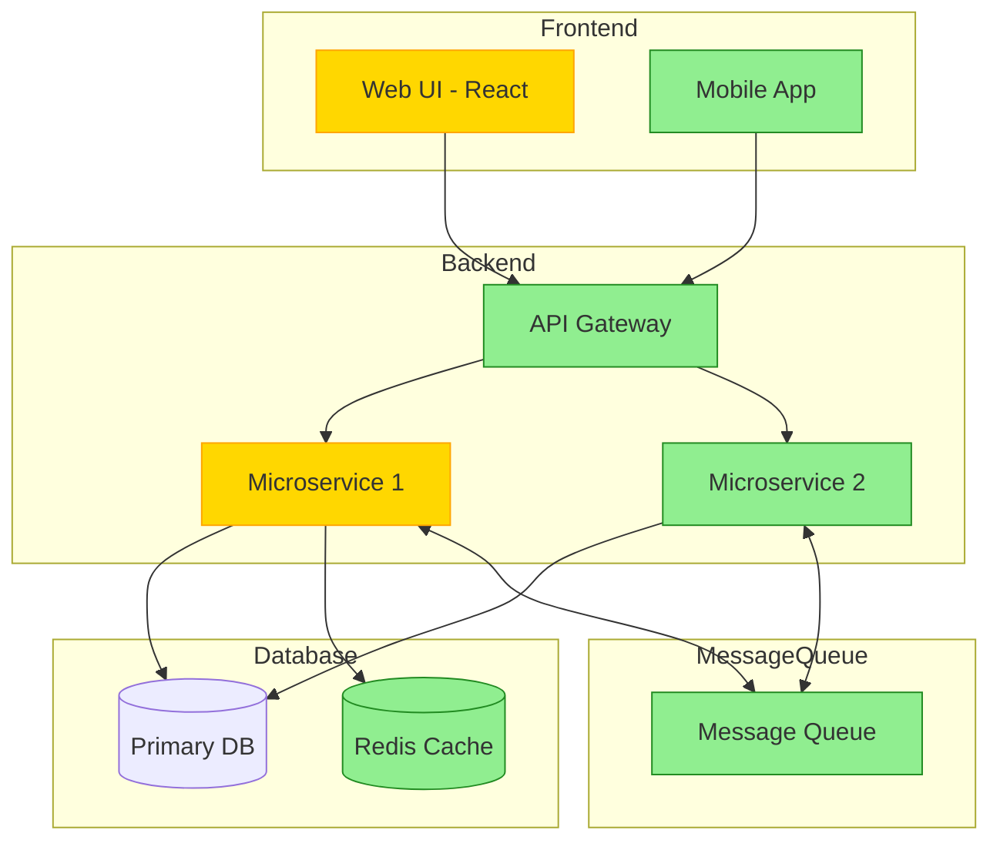
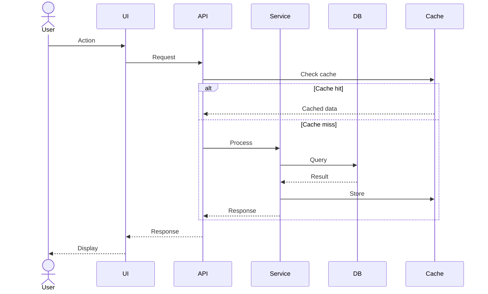
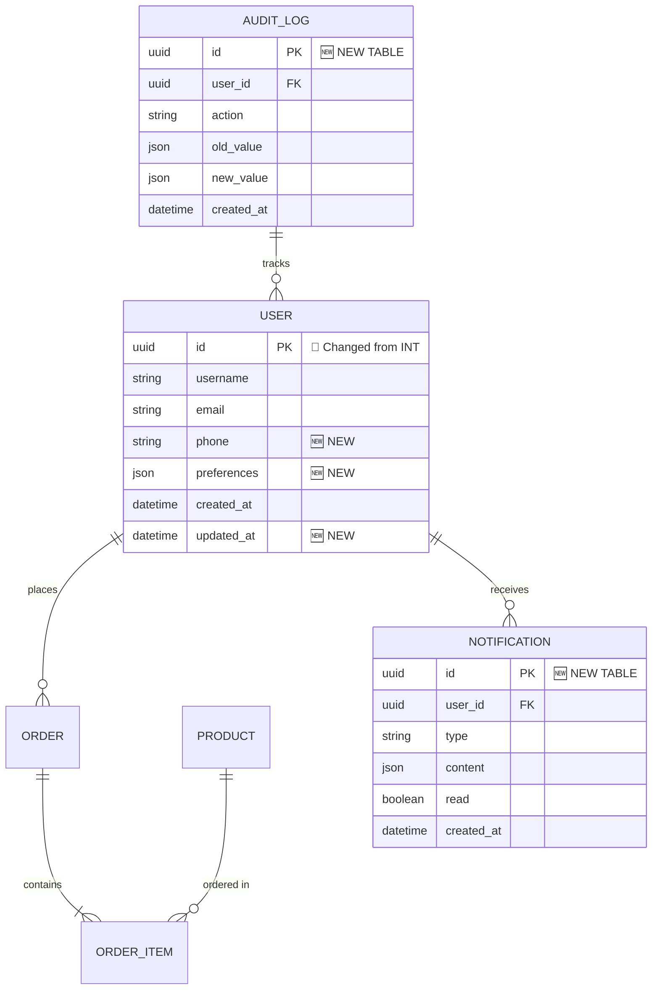

# TO-BE Software Requirements Specification
## [System Name] - Target System Documentation

---

## Document Control

| Field | Value |
|-------|-------|
| Document ID | TO-BE-SRS-[PROJECT]-001 |
| Version | 1.0 |
| Created | [DATE] |
| Last Updated | [DATE] |
| Status | Draft / Review / Approved |
| Author | [NAME] |
| Approved By | [NAME] |
| AS-IS Reference | AS-IS-SRS-[PROJECT]-001 v[X] |

---

## Change Tracking Legend

Throughout this document, changes from AS-IS are marked as:
- 🆕 **NEW** - Completely new feature/requirement
- 🔄 **MODIFIED** - Changed from AS-IS
- ❌ **REMOVED** - Will not be in TO-BE system
- ✅ **UNCHANGED** - Same as AS-IS (carry forward)

---

## 1. Introduction

### 1.1 Purpose
Tài liệu này mô tả hệ thống [SYSTEM NAME] mới sẽ được xây dựng
để thay thế hệ thống hiện tại. Document này dựa trên AS-IS SRS
và bổ sung các thay đổi, cải tiến, và tính năng mới.

### 1.2 Scope
- **Included**: [List modules/features trong scope]
- **Excluded**: [List modules/features không trong scope]

### 1.3 Reference Documents
| Document | Version | Purpose |
|----------|---------|---------|
| AS-IS-SRS | [Version] | Baseline reference |
| Change Requests | [Version] | Approved changes |
| Gap Analysis | [Version] | AS-IS vs TO-BE comparison |

---

## 2. Executive Summary of Changes

### 2.1 High-Level Change Summary
| Category | New | Modified | Removed | Unchanged |
|----------|-----|----------|---------|-----------|
| Modules | [X] | [X] | [X] | [X] |
| Features | [X] | [X] | [X] | [X] |
| Integrations | [X] | [X] | [X] | [X] |
| Reports | [X] | [X] | [X] | [X] |

### 2.2 Key Improvements
| ID | Improvement | Business Value | Priority |
|----|-------------|----------------|----------|
| IMP-001 | [Description] | [Value] | High |
| IMP-002 | [Description] | [Value] | Medium |

### 2.3 Deprecated Features
| Feature | Reason for Removal | Migration Path |
|---------|-------------------|----------------|
| [Feature] | [Reason] | [How users will do this instead] |

---

## 3. System Overview (TO-BE)

### 3.1 System Context 🔄 MODIFIED
[Mô tả hệ thống mới trong bối cảnh business]



### 3.2 User Roles 🔄 MODIFIED
| Role | Status | Description | Changes from AS-IS |
|------|--------|-------------|-------------------|
| [Role 1] | ✅ UNCHANGED | [Description] | - |
| [Role 2] | 🔄 MODIFIED | [Description] | [What changed] |
| [Role 3] | 🆕 NEW | [Description] | New role |
| [Role 4] | ❌ REMOVED | - | [Merged into Role X] |

### 3.3 System Architecture (TO-BE) 🔄 MODIFIED


**Architecture Changes Summary:**
| Component | AS-IS | TO-BE | Reason |
|-----------|-------|-------|--------|
| Frontend | [Old tech] | [New tech] | [Reason] |
| Backend | [Old arch] | [New arch] | [Reason] |
| Database | [Old DB] | [New DB] | [Reason] |

---

## 4. Functional Requirements (TO-BE)

### 4.1 Module: [Module Name 1] 🔄 MODIFIED

#### 4.1.1 Feature: [Feature Name] ✅ UNCHANGED
| Field | Value |
|-------|-------|
| ID | TB-FR-001 |
| AS-IS Reference | AS-FR-001 |
| Status | ✅ UNCHANGED |
| Description | [Same as AS-IS] |

---

#### 4.1.2 Feature: [Feature Name] 🔄 MODIFIED
| Field | Value |
|-------|-------|
| ID | TB-FR-002 |
| AS-IS Reference | AS-FR-002 |
| Status | 🔄 MODIFIED |
| Description | [Updated description] |

**Changes from AS-IS:**
| Aspect | AS-IS | TO-BE | Reason |
|--------|-------|-------|--------|
| [Aspect 1] | [Old] | [New] | [Why changed] |
| [Aspect 2] | [Old] | [New] | [Why changed] |

**TO-BE Behavior:**
[Mô tả chi tiết cách feature sẽ hoạt động]

**TO-BE User Flow:**


**Business Rules (TO-BE):**
| Rule ID | Rule Description | Status | Change |
|---------|------------------|--------|--------|
| BR-001 | [Rule description] | ✅ UNCHANGED | - |
| BR-002 | [Rule description] | 🔄 MODIFIED | [What changed] |
| BR-003 | [Rule description] | 🆕 NEW | New rule |

**Acceptance Criteria:**
```gherkin
Given [precondition]
When [action]
Then [expected result]
```

---

#### 4.1.3 Feature: [New Feature Name] 🆕 NEW
| Field | Value |
|-------|-------|
| ID | TB-FR-003 |
| AS-IS Reference | N/A (New) |
| Status | 🆕 NEW |
| Description | [Feature description] |
| Priority | High / Medium / Low |
| Requested By | [Stakeholder] |

**Business Justification:**
[Why this new feature is needed]

**User Stories:**
```
As a [role]
I want to [action]
So that [benefit]
```

**Acceptance Criteria:**
```gherkin
Scenario: [Scenario name]
Given [precondition]
When [action]
Then [expected result]
```

**Wireframe/Mockup:**
[Link or embedded image]

---

### 4.2 Module: [Module Name 2] 🆕 NEW
[Document new module with all features]

---

### 4.3 Removed Features ❌

#### 4.3.1 Feature: [Removed Feature Name]
| Field | Value |
|-------|-------|
| AS-IS Reference | AS-FR-XXX |
| Status | ❌ REMOVED |
| Reason | [Why removed] |
| Alternative | [How to achieve same goal in TO-BE] |
| Migration Notes | [What happens to existing data/users] |

---

## 5. Data Model (TO-BE)

### 5.1 Entity Relationship Diagram 🔄 MODIFIED


### 5.2 Data Model Changes Summary
| Table | Status | Changes |
|-------|--------|---------|
| USER | 🔄 MODIFIED | Added: phone, preferences, updated_at. Changed: id type |
| ORDER | ✅ UNCHANGED | - |
| NOTIFICATION | 🆕 NEW | New table for notification system |
| AUDIT_LOG | 🆕 NEW | New table for audit trail |
| [OLD_TABLE] | ❌ REMOVED | Data migrated to [NEW_TABLE] |

### 5.3 Data Dictionary (TO-BE)

#### Table: user 🔄 MODIFIED
| Column | Type | Status | AS-IS Type | Changes |
|--------|------|--------|------------|---------|
| id | UUID | 🔄 | INT | Changed for distributed system |
| username | VARCHAR(50) | ✅ | VARCHAR(50) | - |
| email | VARCHAR(100) | ✅ | VARCHAR(100) | - |
| phone | VARCHAR(20) | 🆕 | N/A | New field for 2FA |
| preferences | JSONB | 🆕 | N/A | Store user preferences |
| created_at | TIMESTAMP | ✅ | DATETIME | - |
| updated_at | TIMESTAMP | 🆕 | N/A | Track modifications |

### 5.4 Data Migration Plan
| Source Table | Target Table | Transformation | Notes |
|--------------|--------------|----------------|-------|
| user.id (INT) | user.id (UUID) | Generate new UUID, create mapping table | Keep mapping for 6 months |
| [old_field] | [new_field] | [Transformation logic] | [Notes] |

---

## 6. API Specification (TO-BE)

### 6.1 API Overview 🔄 MODIFIED
| Field | AS-IS | TO-BE | Change |
|-------|-------|-------|--------|
| Base URL | [Old URL] | [New URL] | 🔄 |
| Version | v1 | v2 | 🔄 |
| Authentication | [Old] | OAuth 2.0 + JWT | 🔄 |
| Format | JSON | JSON | ✅ |
| Rate Limiting | None | 100 req/min | 🆕 |

### 6.2 API Changes Summary
| Endpoint | Status | Changes |
|----------|--------|---------|
| GET /api/v2/users | 🔄 MODIFIED | Added pagination, filtering |
| POST /api/v2/users | ✅ UNCHANGED | - |
| GET /api/v2/notifications | 🆕 NEW | New endpoint |
| GET /api/v1/legacy | ❌ DEPRECATED | Use /api/v2/new instead |

### 6.3 Endpoint Specifications

#### GET /api/v2/users 🔄 MODIFIED

**Changes from AS-IS:**
- Added pagination support
- Added filtering by status
- Response includes new fields

Request:
```json
{
  "query_params": {
    "page": "number (new)",
    "limit": "number (new, default: 20)",
    "status": "string (new: active|inactive)",
    "search": "string"
  },
  "headers": {
    "Authorization": "Bearer {token} (changed from API key)"
  }
}
```

Response:
```json
{
  "data": [
    {
      "id": "uuid (changed from int)",
      "username": "string",
      "email": "string",
      "phone": "string (new)",
      "status": "string (new)",
      "created_at": "datetime",
      "updated_at": "datetime (new)"
    }
  ],
  "pagination": {
    "total": 100,
    "page": 1,
    "limit": 20,
    "pages": 5
  },
  "meta": {
    "api_version": "2.0 (new)"
  }
}
```

---

## 7. Business Rules (TO-BE)

### 7.1 Business Rules Changes
| Rule ID | Status | AS-IS | TO-BE | Reason |
|---------|--------|-------|-------|--------|
| BR-001 | ✅ | [Rule] | [Same] | - |
| BR-002 | 🔄 | [Old rule] | [New rule] | [Reason] |
| BR-003 | 🆕 | N/A | [New rule] | [Reason] |
| BR-004 | ❌ | [Old rule] | Removed | [Reason] |

### 7.2 New Validation Rules 🆕
| Rule ID | Entity | Field | Rule | Priority |
|---------|--------|-------|------|----------|
| VR-NEW-001 | User | phone | Valid phone format | High |

### 7.3 New Workflow Rules 🆕
| Rule ID | Trigger | Condition | Action |
|---------|---------|-----------|--------|
| WR-NEW-001 | User created | Always | Send welcome email |

---

## 8. Non-Functional Requirements (TO-BE)

### 8.1 Performance Requirements 🔄 MODIFIED
| Metric | AS-IS (Current) | TO-BE (Target) | Improvement |
|--------|-----------------|----------------|-------------|
| Page Load Time | 3s | < 1s | 66% faster |
| API Response Time | 500ms | < 200ms | 60% faster |
| Concurrent Users | 100 | 1000 | 10x capacity |
| Database Queries/sec | 1000 | 10000 | 10x throughput |

### 8.2 Security Requirements 🔄 MODIFIED
| Aspect | AS-IS | TO-BE | Priority |
|--------|-------|-------|----------|
| Authentication | Basic Auth | OAuth 2.0 + MFA | 🔄 High |
| Authorization | Role-based | Role + Permission based | 🔄 High |
| Data Encryption | At rest only | At rest + In transit | 🔄 High |
| Audit Logging | None | Full audit trail | 🆕 High |
| Session Management | Server-side | JWT + Refresh tokens | 🔄 Medium |

### 8.3 Scalability Requirements 🆕 NEW
| Requirement | Specification |
|-------------|---------------|
| Horizontal scaling | Support auto-scaling 2-10 instances |
| Database | Read replicas for scaling reads |
| Caching | Redis cluster for session and data cache |
| CDN | Static assets served via CDN |

### 8.4 Availability Requirements 🆕 NEW
| Requirement | Specification |
|-------------|---------------|
| Uptime SLA | 99.9% availability |
| RTO | Recovery Time Objective: < 1 hour |
| RPO | Recovery Point Objective: < 15 minutes |
| Backup | Daily full backup, hourly incremental |

---

## 9. Integration Requirements (TO-BE)

### 9.1 Integration Changes Summary
| Integration | Status | Changes |
|-------------|--------|---------|
| [System 1] | ✅ UNCHANGED | - |
| [System 2] | 🔄 MODIFIED | Updated API version |
| [System 3] | 🆕 NEW | New integration |
| [System 4] | ❌ REMOVED | No longer needed |

### 9.2 New Integration: [System Name] 🆕
| Field | Value |
|-------|-------|
| System | [External system name] |
| Purpose | [Why integrating] |
| Direction | Inbound / Outbound / Bidirectional |
| Protocol | REST API / GraphQL / Message Queue |
| Authentication | OAuth 2.0 / API Key / mTLS |
| Data Exchange | [What data is exchanged] |
| Frequency | Real-time / Batch |
| Error Handling | [How errors are handled] |

---

## 10. User Interface (TO-BE)

### 10.1 UI Changes Summary
| Screen | Status | Changes |
|--------|--------|---------|
| Dashboard | 🔄 MODIFIED | New widgets, responsive design |
| User List | ✅ UNCHANGED | - |
| [New Screen] | 🆕 NEW | [Description] |
| [Old Screen] | ❌ REMOVED | Functionality moved to [X] |

### 10.2 New Screen: [Screen Name] 🆕
| Field | Value |
|-------|-------|
| ID | TB-SCR-001 |
| Name | [Screen Name] |
| Purpose | [What it does] |
| Access | [User roles] |
| Wireframe | [Link to wireframe/mockup] |

**UI Elements:**
| Element | Type | Behavior |
|---------|------|----------|
| [Element] | [Type] | [What it does] |

### 10.3 UI/UX Improvements 🆕
| Improvement | Description | Business Value |
|-------------|-------------|----------------|
| Responsive Design | Works on mobile/tablet | Increase mobile users |
| Dark Mode | User preference | User satisfaction |
| Accessibility | WCAG 2.1 AA compliance | Legal compliance |

---

## 11. Migration Considerations

### 11.1 Data Migration
| Data | Strategy | Downtime | Rollback Plan |
|------|----------|----------|---------------|
| User data | ETL with transformation | 2 hours | Restore from backup |
| Transaction history | Batch migration | None (background) | Re-run migration |

### 11.2 Feature Migration
| Feature | Migration Approach | Training Needed |
|---------|-------------------|-----------------|
| [Feature 1] | Direct replacement | Yes - new UI |
| [Feature 2] | Gradual rollout | Minimal |

### 11.3 Rollback Strategy
[Define rollback procedures for each component]

---

## 12. Appendices

### Appendix A: Wireframes/Mockups
[Links to design files]

### Appendix B: API Documentation (Full)
[Link to Swagger/OpenAPI spec]

### Appendix C: Change Request Log
| CR ID | Description | Requester | Status | Included |
|-------|-------------|-----------|--------|----------|
| CR-001 | [Description] | [Name] | Approved | Yes |

### Appendix D: Traceability Matrix
| TO-BE Req | AS-IS Req | Status | Test Case |
|-----------|-----------|--------|-----------|
| TB-FR-001 | AS-FR-001 | ✅ | TC-001 |
| TB-FR-002 | AS-FR-002 | 🔄 | TC-002 |
| TB-FR-003 | N/A | 🆕 | TC-003 |

---

## Document History

| Version | Date | Author | Changes |
|---------|------|--------|---------|
| 1.0 | [DATE] | [NAME] | Initial TO-BE document |

---

*Generated by F5 Framework - Legacy Migration Workflow*
