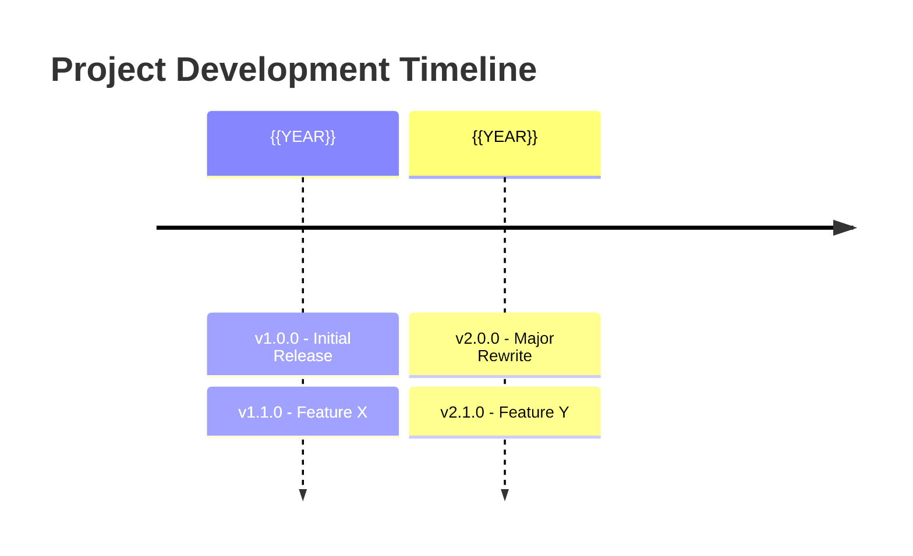

# Prompt: Analyze Git History

> **Purpose**: Extract version history and development phases from git
> **Input**: Git repository
> **Output**: Version timeline and phase documentation

---

## Prompt Template

```
Analyze the git history of [PROJECT_PATH] to understand project evolution.

## 1. Version Tags Analysis

List all version tags:
```bash
git tag -l --sort=-version:refname
```

For each tag, extract:
- Tag name
- Date created
- Commit message/description
- Key changes (from tag message or commit range)

## 2. Branch Structure

Identify branch strategy:
```bash
git branch -a
```

Document:
- Main/master branch
- Development branches
- Feature branch naming convention
- Release branch pattern

## 3. Commit Frequency Analysis

Analyze development activity:
```bash
# Commits per month
git log --format='%aI' | cut -c1-7 | sort | uniq -c

# Commits by author
git shortlog -sn

# Active periods
git log --pretty=format:"%ad" --date=short | uniq -c
```

## 4. Major Changes Between Versions

For each version transition:
```bash
git diff v1.0..v2.0 --stat
git log v1.0..v2.0 --oneline
```

Extract:
- Files added/modified/deleted
- Key commit messages
- Breaking changes indicators

## 5. Database Migration History

```bash
# List migrations
ls -la database/migrations/

# Changes between versions
git diff v1.0..v2.0 -- database/migrations/
```

Document:
- New tables per version
- Schema changes
- Data migrations

## 6. Dependency Changes

```bash
# Compare package versions
git diff v1.0..v2.0 -- composer.json package.json
```

---

## Output Format

```markdown
# Git History Analysis: {{PROJECT_NAME}}

## Overview

| Metric | Value |
|--------|-------|
| First Commit | {{DATE}} |
| Latest Commit | {{DATE}} |
| Total Commits | {{COUNT}} |
| Total Tags | {{COUNT}} |
| Contributors | {{COUNT}} |

## Version Timeline



## Versions

### v{{X.Y.Z}} ({{DATE}})

**Phase**: {{PHASE_NAME}}
**Commits**: {{COUNT}}
**Duration**: {{DAYS}} days

**Key Changes**:
- Added: {{feature}}
- Modified: {{feature}}
- Fixed: {{bug}}

**Database Changes**:
- New tables: {{tables}}
- Modified: {{tables}}

**Breaking Changes**:
- {{description}}

---

### v{{X.Y.Z}} ({{DATE}})

...

## Development Phases

| Phase | Versions | Period | Focus |
|-------|----------|--------|-------|
| Phase 1 | v0.1-v1.0 | {{DATE}}-{{DATE}} | Core features |
| Phase 2 | v1.1-v2.0 | {{DATE}}-{{DATE}} | Scale & performance |
| Phase 3 | v2.1+ | {{DATE}}-now | Enterprise features |

## Contribution Analysis

| Contributor | Commits | Focus Areas |
|-------------|---------|-------------|
| {{name}} | {{count}} | {{areas}} |

## Recommendations

Based on git history:
1. {{recommendation}}
2. {{recommendation}}
```

---

## Useful Git Commands

### Find when file was added
```bash
git log --diff-filter=A -- path/to/file
```

### Find when feature was added
```bash
git log --all --oneline --grep="feature name"
```

### Compare specific files between versions
```bash
git diff v1.0..v2.0 -- app/Models/Entity.php
```

### Get commit count between versions
```bash
git rev-list --count v1.0..v2.0
```

### Find large changes
```bash
git log --oneline --stat | grep -E "^\s+[0-9]+ files changed"
```

---

## Checklist

- [ ] All version tags documented
- [ ] Branch strategy understood
- [ ] Major changes identified
- [ ] Database migrations tracked
- [ ] Development phases defined
- [ ] Contributors credited
```

---

## Usage

1. Run git commands in project directory
2. Create version timeline
3. Document each phase's changes
4. Identify breaking changes between versions
