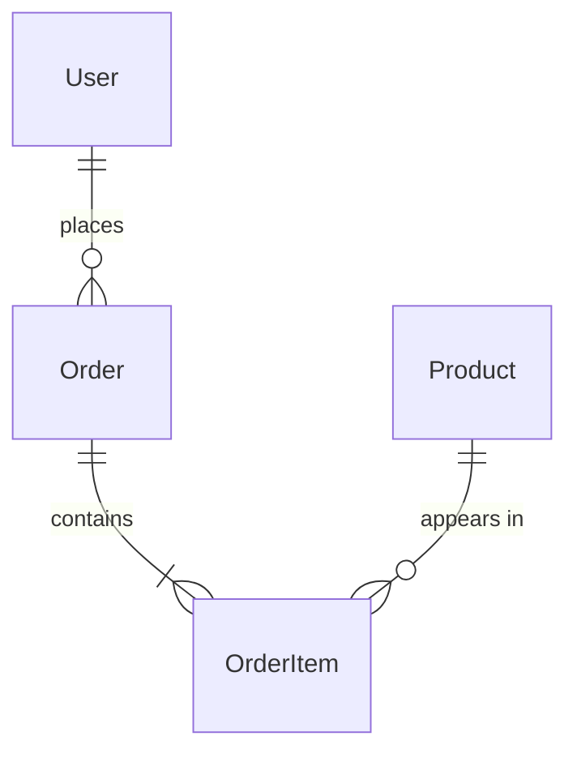

# Prompt: Analyze Laravel Project

> **Purpose**: Comprehensive Laravel project analysis
> **Input**: Laravel project directory
> **Output**: Full system documentation

---

## Prompt Template

```
Analyze the Laravel project at [PROJECT_PATH] and generate comprehensive documentation.

## Phase 1: Project Overview

### 1.1 Laravel Version & Stack
```bash
php artisan --version
cat composer.json | grep -E "(laravel/framework|php)"
```

Extract:
- Laravel version
- PHP version
- Key packages (Livewire, Filament, Inertia, etc.)
- Database driver

### 1.2 Application Structure

Identify architecture pattern:
- Standard MVC
- Domain-Driven Design
- Clean Architecture
- Custom structure

Document directory organization:
```
app/
├── Console/
├── Exceptions/
├── Http/
│   ├── Controllers/
│   ├── Middleware/
│   └── Requests/
├── Models/
├── Providers/
├── Services/        # If exists
├── Repositories/    # If exists
└── ...
```

### 1.3 Configuration

Review key config files:
```bash
ls -la config/
```

Document environment variables used:
```bash
grep -r "env(" config/ | grep -v "\.git"
```

---

## Phase 2: Database Analysis

### 2.1 Migrations

```bash
ls -la database/migrations/
php artisan migrate:status
```

For each migration:
- Table created/modified
- Columns and types
- Indexes and foreign keys
- Timestamps and soft deletes

### 2.2 Models

Analyze all models in `app/Models/`:

```php
// Check for:
- $fillable / $guarded
- $casts
- $with (eager loading)
- Relationships (hasOne, hasMany, belongsTo, etc.)
- Scopes
- Accessors/Mutators
- Business methods
- Constants (status, types)
- Traits used
```

### 2.3 Generate ERD

Create Mermaid ERD from models and migrations:



---

## Phase 3: Routes & Controllers

### 3.1 Route Analysis

```bash
php artisan route:list --json
```

Categorize routes:
- Web routes (web.php)
- API routes (api.php)
- Admin routes
- Auth routes

### 3.2 Controller Analysis

For each controller:
- Actions/methods
- Dependencies injected
- FormRequest used
- Response types
- Authorization checks

### 3.3 API Endpoints

Document API structure:
| Method | Endpoint | Controller | Auth | Description |
|--------|----------|------------|------|-------------|

---

## Phase 4: Business Logic

### 4.1 Services

Analyze `app/Services/` if exists:
- Service classes and their responsibilities
- Dependencies
- Public methods

### 4.2 Events & Listeners

```bash
ls -la app/Events/
ls -la app/Listeners/
```

Document event flow:
- Event name
- When triggered
- Listeners
- Side effects

### 4.3 Jobs & Queues

```bash
ls -la app/Jobs/
```

Document:
- Job classes
- Queue configuration
- Scheduled tasks

### 4.4 Validation Rules

From FormRequest classes:
- Validation rules
- Custom rules
- Authorization logic

---

## Phase 5: Frontend Analysis

### 5.1 View Structure

```bash
ls -la resources/views/
```

Identify:
- Blade templates
- Livewire components
- Vue/React components (if Inertia)
- Layout structure

### 5.2 Assets

```bash
cat package.json
```

Document:
- CSS framework (Tailwind, Bootstrap)
- JS framework
- Build tool (Vite, Mix)

---

## Phase 6: Authentication & Authorization

### 6.1 Auth System

Identify auth method:
- Laravel Fortify
- Laravel Breeze
- Laravel Jetstream
- Custom auth

### 6.2 Roles & Permissions

If using Spatie/laravel-permission or similar:
```bash
ls -la app/Models/Role.php
ls -la app/Models/Permission.php
```

Document:
- Available roles
- Permission structure
- Policy classes

---

## Output Structure

Generate documentation in `.f5/docs/`:

```
.f5/docs/
├── README.md                    # Project overview
├── 01-system-overview.md        # Architecture & stack
├── 02-database-design.md        # ERD & migrations
├── 03-entity-states.md          # State machines
├── 04-business-rules.md         # All business logic
├── modules/
│   ├── auth.md                  # Authentication
│   ├── [module].md              # Per module
│   └── ...
├── api/
│   └── api-catalog.md           # All endpoints
└── screens/
    └── screen-catalog.md        # All screens
```

---

## Key Files to Analyze

| Purpose | Files |
|---------|-------|
| Routes | `routes/web.php`, `routes/api.php` |
| Models | `app/Models/*.php` |
| Controllers | `app/Http/Controllers/**/*.php` |
| Requests | `app/Http/Requests/*.php` |
| Services | `app/Services/*.php` |
| Migrations | `database/migrations/*.php` |
| Config | `config/*.php` |
| Events | `app/Events/*.php` |
| Observers | `app/Observers/*.php` |
| Policies | `app/Policies/*.php` |
| Views | `resources/views/**/*.blade.php` |

---

## Checklist

- [ ] Laravel version identified
- [ ] Package dependencies documented
- [ ] All migrations analyzed
- [ ] All models documented with relationships
- [ ] ERD generated
- [ ] All routes cataloged
- [ ] Controllers analyzed
- [ ] Business rules extracted
- [ ] Auth system documented
- [ ] Frontend stack identified
- [ ] Events/listeners mapped
- [ ] Scheduled tasks documented
```

---

## Usage

1. Run this prompt with Claude Code at project root
2. Follow each phase sequentially
3. Generate documentation in `.f5/docs/`
4. Validate with stakeholders
