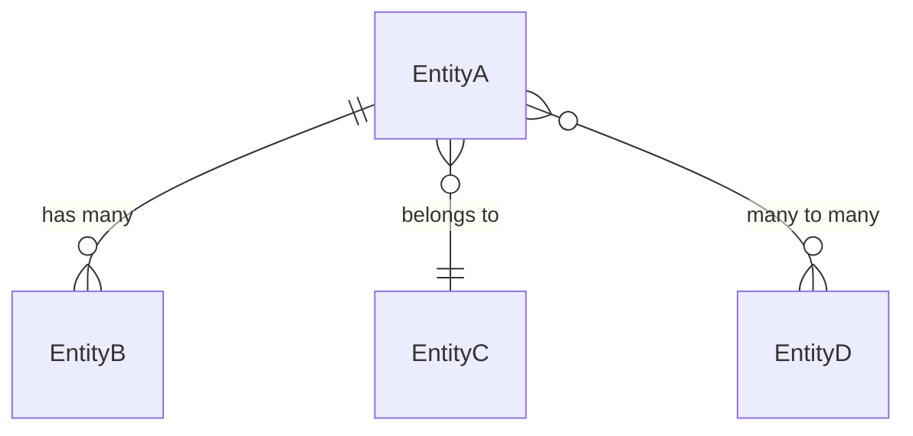
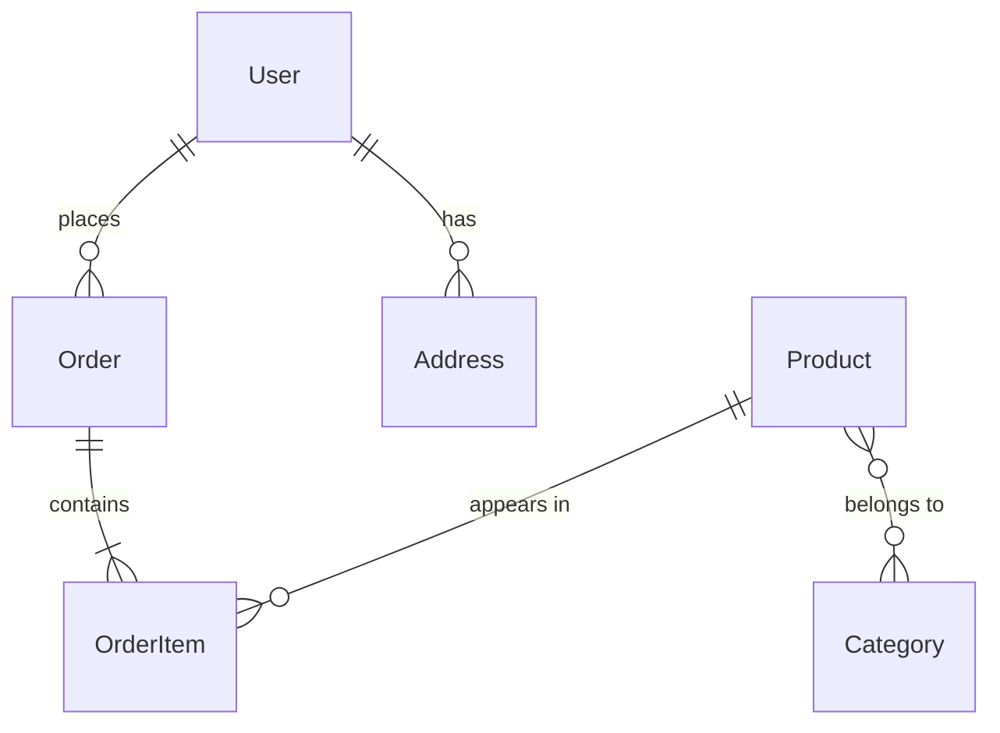

# Prompt: Extract Entities

> **Purpose**: Extract all entities from any codebase
> **Input**: Source code directory
> **Output**: Entity catalog with relationships

---

## Prompt Template

```
Analyze the codebase at [PROJECT_PATH] and extract ALL entities/models.

## Step 1: Identify Entity Sources

Look in these locations based on framework:

### Laravel/PHP
- `app/Models/*.php`
- `database/migrations/*.php`
- Entity definitions in doctrine/eloquent

### Node.js/TypeScript
- `src/entities/*.ts`
- `src/models/*.ts`
- Prisma schema: `prisma/schema.prisma`
- TypeORM entities
- Sequelize models

### Python/Django
- `*/models.py`
- SQLAlchemy models
- Pydantic models

### Java/Spring
- `**/entity/*.java`
- `**/model/*.java`
- JPA entities

### Go
- `**/models/*.go`
- `**/entities/*.go`
- GORM models

---

## Step 2: Extract Entity Information

For EACH entity, extract:

### 2.1 Basic Information
- Entity/Model name
- Table name (if ORM)
- Source file path
- Primary key type

### 2.2 Attributes/Fields
| Attribute | Type | Nullable | Default | Description |
|-----------|------|----------|---------|-------------|
| id | int/uuid | NO | auto | Primary key |
| name | string | NO | - | Entity name |
| status | enum | NO | 'draft' | Current state |

### 2.3 Relationships



| Relationship | Type | Related Entity | Keys | Description |
|--------------|------|----------------|------|-------------|
| items | hasMany | Item | entity_id | Child items |
| owner | belongsTo | User | owner_id | Owner |
| tags | manyToMany | Tag | pivot table | Tags |

### 2.4 Status/States
| Status | Value | Description | Transitions To |
|--------|-------|-------------|----------------|
| DRAFT | 'draft' | Initial | pending |
| PENDING | 'pending' | Waiting | approved, rejected |
| APPROVED | 'approved' | Final | - |

### 2.5 Indexes
| Index Name | Columns | Type | Purpose |
|------------|---------|------|---------|
| idx_status | status | INDEX | Filter by status |
| uniq_code | code | UNIQUE | Unique codes |

### 2.6 Key Methods/Behaviors
| Method | Purpose | Returns |
|--------|---------|---------|
| canEdit() | Check edit permission | bool |
| calculate() | Compute totals | number |

---

## Step 3: Generate Entity Catalog

### Summary Table

| Entity | Table | Relationships | Status Field | Key Methods |
|--------|-------|---------------|--------------|-------------|
| User | users | 5 | status | canLogin(), isAdmin() |
| Order | orders | 3 | order_status | canCancel(), total() |

### Entity Grouping

Group entities by module/domain:

```markdown
## Core Entities
- User
- Role
- Permission

## Business Entities
- Order
- Product
- Customer

## Support Entities
- Log
- Notification
- Setting
```

---

## Step 4: Generate ERD

Create comprehensive ERD using Mermaid:



---

## Output Format

Generate individual entity docs:

```markdown
# Entity: {{EntityName}}

## Overview
{{Brief description}}

## Table: `{{table_name}}`

### Columns
| Column | Type | Nullable | Default | Description |
|--------|------|----------|---------|-------------|

### Relationships
| Relationship | Type | Related | Keys |
|--------------|------|---------|------|

### States
| State | Value | Description |
|-------|-------|-------------|

### Key Methods
| Method | Purpose |
|--------|---------|

## Source
`{{file_path}}`
```

---

## Language-Specific Patterns

### Laravel Eloquent
```php
class Entity extends Model
{
    protected $fillable = [];     // → Attributes
    protected $casts = [];        // → Types
    public function relation() {} // → Relationships
    public function scopeActive() {} // → Query scopes
}
```

### Prisma
```prisma
model Entity {
  id        Int      @id @default(autoincrement())
  name      String
  status    Status   @default(DRAFT)
  items     Item[]   // → Relationship
  owner     User     @relation(fields: [ownerId])
}
```

### TypeORM
```typescript
@Entity()
class Entity {
  @PrimaryGeneratedColumn()
  id: number;

  @Column()
  name: string;

  @OneToMany(() => Item, item => item.entity)
  items: Item[];
}
```

### SQLAlchemy
```python
class Entity(Base):
    __tablename__ = 'entities'
    id = Column(Integer, primary_key=True)
    name = Column(String)
    items = relationship("Item", back_populates="entity")
```

---

## Checklist

- [ ] All entity files identified
- [ ] Each entity documented
- [ ] Relationships mapped
- [ ] States/status identified
- [ ] ERD generated
- [ ] Entities grouped by domain
- [ ] Source files referenced
```

---

## Usage

1. Identify framework/ORM used
2. Locate all entity/model files
3. Extract each entity's details
4. Generate relationship diagram
5. Create entity catalog in `.f5/docs/`
