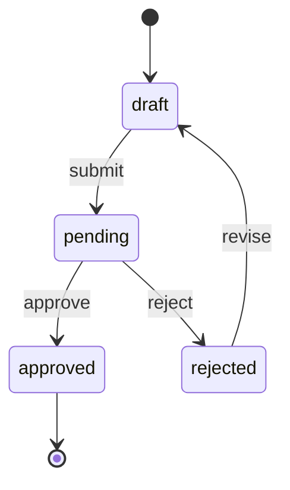

# Entity Documentation Template

> Template for documenting a single entity/model

---

```markdown
# Entity: {{ENTITY_NAME}}

> **Table**: `{{table_name}}`
> **Source**: `{{source_file}}`
> **Last Updated**: {{DATE}}

---

## Overview

{{ENTITY_DESCRIPTION}}

## Database Schema

### Table: `{{table_name}}`

| Column | Type | Nullable | Default | Description |
|--------|------|----------|---------|-------------|
| id | BIGINT | NO | AUTO | Primary key |
| {{column}} | {{type}} | {{nullable}} | {{default}} | {{description}} |
| created_at | TIMESTAMP | YES | NULL | Created timestamp |
| updated_at | TIMESTAMP | YES | NULL | Updated timestamp |
| deleted_at | TIMESTAMP | YES | NULL | Soft delete timestamp |

### Indexes

| Name | Columns | Type | Description |
|------|---------|------|-------------|
| PRIMARY | id | PRIMARY | Primary key |
| {{index_name}} | {{columns}} | {{type}} | {{description}} |

### Foreign Keys

| Name | Column | References | On Delete |
|------|--------|------------|-----------|
| {{fk_name}} | {{column}} | {{table}}.{{column}} | {{action}} |

## Relationships

```mermaid
erDiagram
    {{ENTITY_NAME}} ||--o{ RelatedEntity : "has many"
    {{ENTITY_NAME}} }o--|| ParentEntity : "belongs to"
```

| Relationship | Type | Related Entity | Keys |
|--------------|------|----------------|------|
| {{relationship}} | {{type}} | {{related}} | {{keys}} |

## States & Lifecycle



### Status Constants

| Status | Value | Description | Next States |
|--------|-------|-------------|-------------|
| DRAFT | 'draft' | Initial state | pending |
| PENDING | 'pending' | Awaiting approval | approved, rejected |
| APPROVED | 'approved' | Final approved | - |
| REJECTED | 'rejected' | Rejected | draft |

### State Transition Rules

| From | To | Condition | Actor | Side Effects |
|------|-----|-----------|-------|--------------|
| draft | pending | All required fields filled | Owner | Send notification |
| pending | approved | Approval condition met | Approver | Update related entities |

## Business Rules

### Validation Rules

| Rule ID | Field | Rule | Source |
|---------|-------|------|--------|
| VR-{{N}} | {{field}} | {{rule}} | `{{file:line}}` |

### Access Control

| Action | Condition | Roles |
|--------|-----------|-------|
| Create | - | admin, user |
| Read | owner OR admin | all |
| Update | owner AND status=draft | admin, owner |
| Delete | status=draft | admin, owner |

### Calculation Rules

| Rule ID | Description | Formula | Source |
|---------|-------------|---------|--------|
| CR-{{N}} | {{description}} | `{{formula}}` | `{{file:method}}` |

## Key Methods

### Business Logic

| Method | Purpose | Parameters | Returns |
|--------|---------|------------|---------|
| `canEdit()` | Check edit permission | - | bool |
| `canDelete()` | Check delete permission | - | bool |
| `submit()` | Submit for approval | - | void |
| `approve()` | Approve entity | - | void |

### Computed Attributes

| Attribute | Description | Logic |
|-----------|-------------|-------|
| `full_name` | Combined name | `first_name + ' ' + last_name` |
| `total_amount` | Calculated total | `sum(items.amount)` |

## Events & Observers

| Event | Trigger | Handler | Side Effects |
|-------|---------|---------|--------------|
| creating | Before create | Observer | Set defaults |
| created | After create | Observer | Send notification |
| updating | Before update | Observer | Validate changes |
| deleted | After delete | Observer | Cascade cleanup |

## Scopes

| Scope | Purpose | Parameters | SQL |
|-------|---------|------------|-----|
| `active()` | Filter active only | - | `WHERE status = 'active'` |
| `byOwner($id)` | Filter by owner | $id | `WHERE owner_id = ?` |
| `recent($days)` | Recent records | $days | `WHERE created_at > ?` |

## API Endpoints

| Method | Endpoint | Description |
|--------|----------|-------------|
| GET | `/api/v1/{{entity}}` | List all |
| GET | `/api/v1/{{entity}}/{id}` | Get one |
| POST | `/api/v1/{{entity}}` | Create |
| PUT | `/api/v1/{{entity}}/{id}` | Update |
| DELETE | `/api/v1/{{entity}}/{id}` | Delete |

## Related Documents

- [Module: {{module}}](./modules/{{module}}.md)
- [Business Rules](./04-business-rules.md#{{entity}})
- [API Catalog](./api/api-catalog.md#{{entity}})

---

*Source: `{{source_file}}`*
```

---

## Usage

1. Copy this template for each entity
2. Replace all `{{PLACEHOLDERS}}`
3. Generate Mermaid diagrams from code analysis
4. Include source file references for traceability
