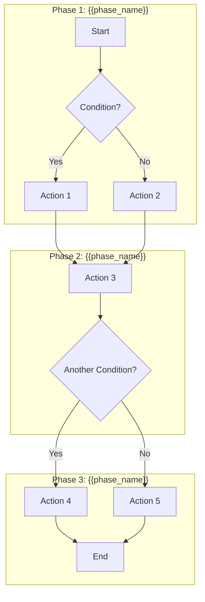
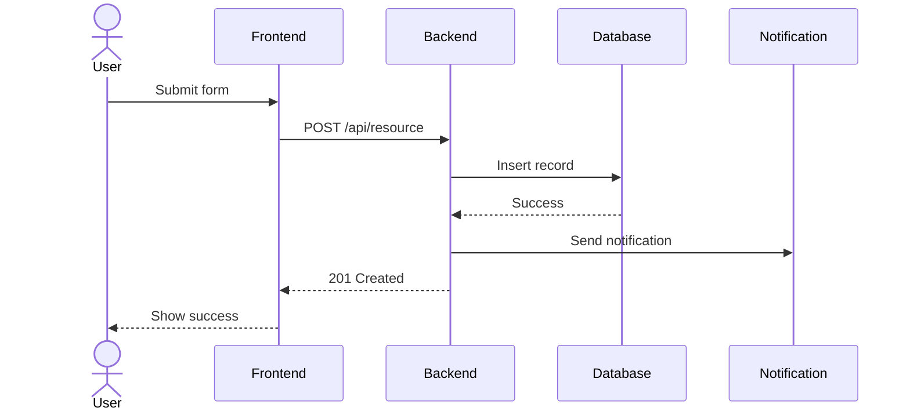

# Workflow Documentation Template

> Template for documenting business workflows

---

```markdown
# Workflow: {{WORKFLOW_NAME}}

> **Module**: {{MODULE}}
> **Actors**: {{ACTORS}}
> **Last Updated**: {{DATE}}

---

## Overview

{{WORKFLOW_DESCRIPTION}}

## Actors

| Actor | Role | Permissions |
|-------|------|-------------|
| {{actor}} | {{role}} | {{permissions}} |

## Flow Diagram



## Steps

### Step 1: {{STEP_NAME}}

| Attribute | Value |
|-----------|-------|
| **Actor** | {{actor}} |
| **Trigger** | {{trigger}} |
| **Preconditions** | {{preconditions}} |
| **Action** | {{action}} |
| **Postconditions** | {{postconditions}} |
| **Next Step** | Step 2 |

**Business Rules Applied:**
- BR-001: {{rule_description}}
- BR-002: {{rule_description}}

**API Called:**
- `POST /api/v1/{{resource}}`

### Step 2: {{STEP_NAME}}

| Attribute | Value |
|-----------|-------|
| **Actor** | {{actor}} |
| **Trigger** | {{trigger}} |
| **Preconditions** | {{preconditions}} |
| **Action** | {{action}} |
| **Postconditions** | {{postconditions}} |
| **Next Step** | Step 3 OR End |

### Step 3: {{STEP_NAME}}

...

## Decision Points

### Decision 1: {{DECISION_NAME}}

| Condition | Result | Next Step |
|-----------|--------|-----------|
| {{condition_1}} | {{result_1}} | Step X |
| {{condition_2}} | {{result_2}} | Step Y |
| Default | {{default_result}} | Step Z |

## State Changes

| Step | Entity | From State | To State |
|------|--------|------------|----------|
| Step 1 | {{Entity}} | - | draft |
| Step 2 | {{Entity}} | draft | pending |
| Step 3 | {{Entity}} | pending | approved |

## Notifications

| Trigger | Recipient | Template | Channel |
|---------|-----------|----------|---------|
| Step 2 completed | Approver | approval_request | Email, In-app |
| Step 3 completed | Creator | approved | Email |
| Rejected | Creator | rejected | Email, In-app |

## Error Handling

| Error | Cause | Resolution |
|-------|-------|------------|
| Validation Error | Invalid input | Show error, stay on step |
| Permission Denied | No access | Show 403, redirect |
| Timeout | Long operation | Retry, notify |

## Sequence Diagram



## Related Documents

- [Entity: {{entity}}](./entities/{{entity}}.md)
- [Module: {{module}}](./modules/{{module}}.md)
- [Business Rules](./04-business-rules.md)

## Technical Implementation

### Controllers

- `{{Controller}}::{{method}}()` - Step 1
- `{{Controller}}::{{method}}()` - Step 2

### Services

- `{{Service}}::{{method}}()` - Business logic

### Events

- `{{Event}}` - Triggered at Step X

---

*Source: Multiple files - see inline references*
```

---

## Usage

1. Identify key workflows in the system
2. Map actors, steps, and decision points
3. Create Mermaid diagrams for visual representation
4. Link to related entities and business rules
